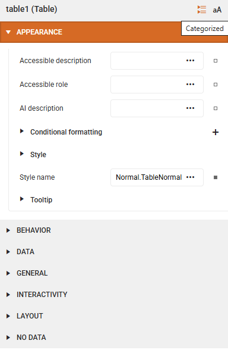
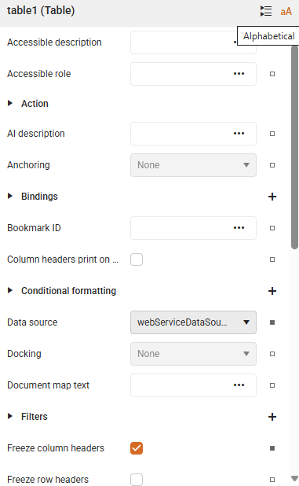
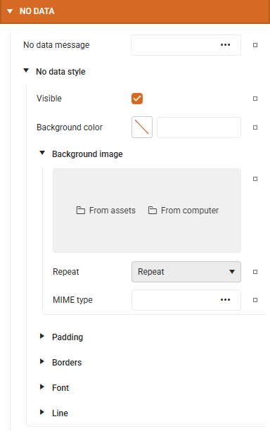
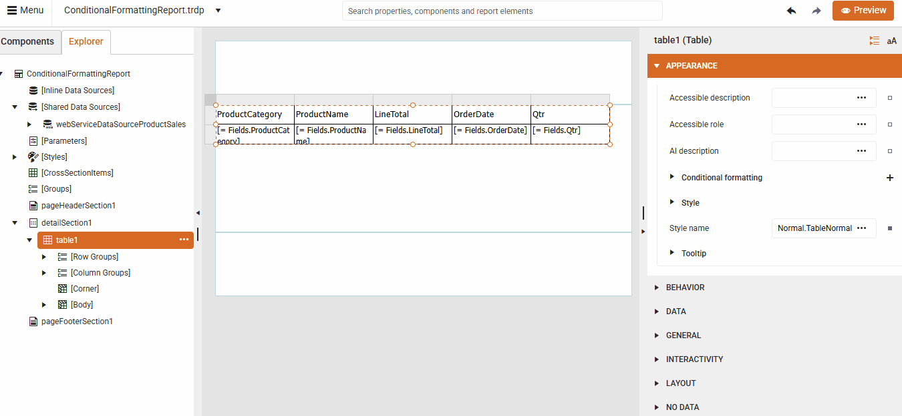
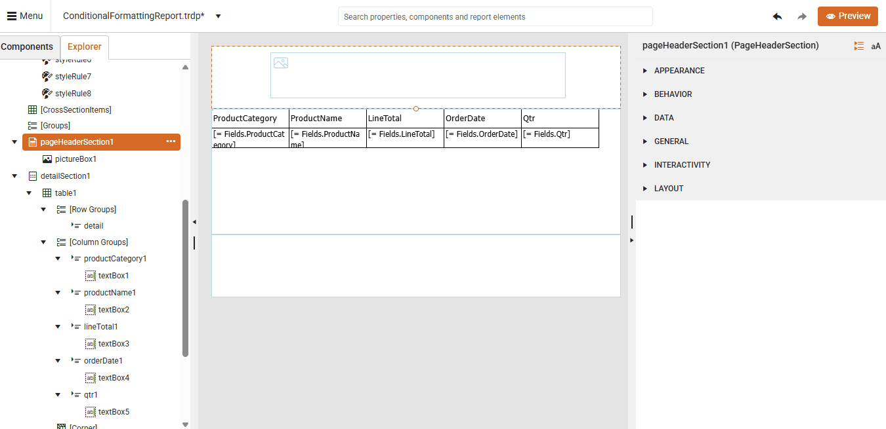
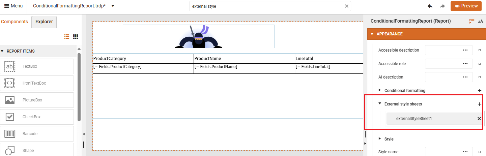
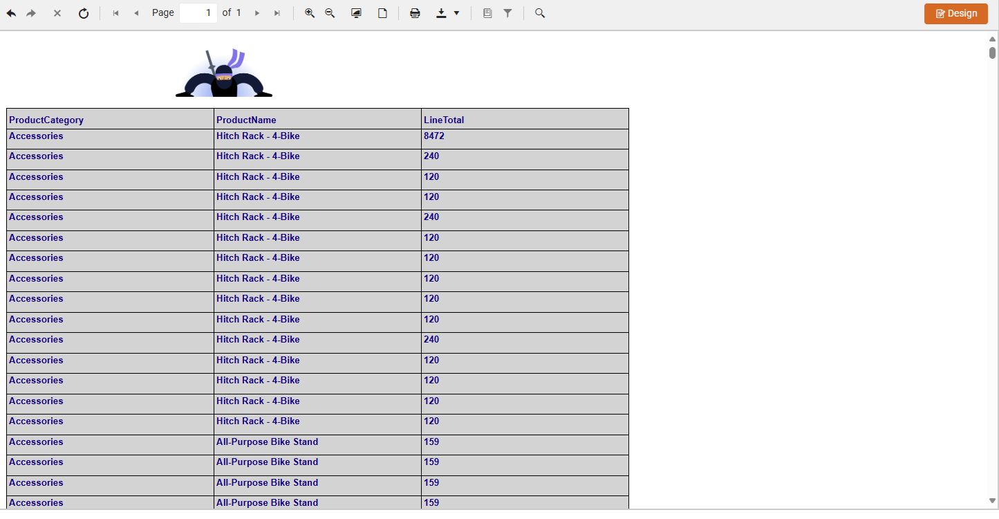

<style>
img[alt$="><"] {
  border: 1px solid lightgrey;
}
</style>

# Customizing Report Items

## Properties Area

The **Properties Area** on the right side of the Web Report Designer **dynamically** displays the properties of the **currently selected** report item - such as a TextBox, Table, Chart, or Panel.

  

Key Features of the Properties Area are:

* **Categorized** and **Alphabetical** Views for easier navigation:

|Categorized|Alphabetical|
|----|----|
| ||

* **Indent Line Guides**: These help visualize the hierarchy of nested properties, improving clarity: 

  

* **Global Search**: A search bar at the top allows you to quickly find specific properties or editors.

   


### Reset Button in the Properties Area

Each editable property in the Properties Area has a small square button next to it - this is the **Reset** button. It reverts the property to its `default` value which is useful when you have applied multiple changes and want to undo a specific one without affecting others. The Reset button helps maintain consistency, especially when working with styles or templates.

    

### Conditional Formatting 

Conditional formatting allows you to dynamically change the appearance of report items based on data values or expressions (condition). Thus, you can indicate values outside the expected range, e.g. if you want to visualize a TextBox, showing revenue, in red color if the revenie is less than 10000.

The following video tutorial shows how to display a Table Report Item (e.g. **LineTotal** TextBox) with alternating style to increase the readability.

<iframe width="560" height="315" src="https://www.youtube.com/embed/rTamBhDmpk0?si=4Ru3nx6__XXfCIon" title="YouTube video player" frameborder="0" allow="accelerometer; autoplay; clipboard-write; encrypted-media; gyroscope; picture-in-picture; web-share" referrerpolicy="strict-origin-when-cross-origin" allowfullscreen></iframe>

When **multiple** items are selected, even though ConditionalFormatting is technically supported on each individual item, the designer cannot guarantee consistent behavior across all selected items. Hence, it does not allow batch editing of conditional formatting rules to make alternating row style for all the cells belonging to the table row. It requires you to apply rules **individually** to each item:
* Select each TextBox (or other report item) one at a time.
* Add the same conditional formatting rule manually.

An alternative approach is to wrap multiple items in a Panel and apply conditional formatting to the panel. This approach is shown in the following video: 

<iframe width="560" height="315" src="https://www.youtube.com/embed/oise1nWPJ0I?si=3yaiqnIwZxoJgdKO" title="YouTube video player" frameborder="0" allow="accelerometer; autoplay; clipboard-write; encrypted-media; gyroscope; picture-in-picture; web-share" referrerpolicy="strict-origin-when-cross-origin" allowfullscreen></iframe>

### StyleSheet Formatting

To apply formatting via external stylesheets, you can use a CSS-like styling model that allows centralized and reusable styling across multiple report items. 

#### Creating a StyleSheet

In the Web Report Designer:

1. Select the **Report** object.

1. Go to the StyleSheet property.

1. Click the `+` button to open the **StyleRule Collection Editor**.

1. Click Add to create a new StyleRule.

1.Define the Style (e.g., background color, font, borders).

1. Add Selectors to target specific items (e.g., all TextBox, PictureBox items).

The following tutorial shows how to define a StyleRule in the report's StyleSheet and apply the style to multiple items using selectors (e.g., by item name or type):

<iframe width="560" height="315" src="https://www.youtube.com/embed/HIjkZc48abM?si=aUZKq7TlyfuwBIp2" title="YouTube video player" frameborder="0" allow="accelerometer; autoplay; clipboard-write; encrypted-media; gyroscope; picture-in-picture; web-share" referrerpolicy="strict-origin-when-cross-origin" allowfullscreen></iframe>

#### Applying Formatting via External Stylesheets


An external StyleSheet is an XML file that contains StyleRules. These rules define how report items should look - similar to CSS in web development. You can apply styles based on:

* **TypeSelector**: Applies to all items of a specific type (e.g., all TextBox items).
* **AttributeSelector**: Applies to items with specific attributes.
* **StyleSelector**: Applies to items with a specific StyleName.
* **DescendantSelector**: Applies to items nested within others.

In the Web Report Designer:

1. Select the **Report** object.

1. Go to the **External style sheets** property.

1. Click the `+` button to add an external StyleSheet.

An external style sheet can be define with:

* **Absolute** Path/URL: for example *C:\Application1\StyleSheets\StyleSheet1.xml* or *https://www.mysite.com/Application1/StyleSheets/StyleSheet1.xml*
* **Relative** Path/URL: for example *.\StyleSheets\StyleSheet1.xml* or *~/StyleSheets/StyleSheet1.xml*

 

A sample rule is demonstrated below. This rule applies to all TextBox items and sets a light gray background, dark blue text, and bold Arial font.

```XML

<StyleSheet>
<StyleRule>
  <Selectors>
    <TypeSelector Type="Telerik.Reporting.TextBox" />
  </Selectors>
  <Style>
    <BackgroundColor>LightGray</BackgroundColor>
    <Color>DarkBlue</Color>
    <Font>
      <Name>Arial</Name>
      <Size>10pt</Size>
      <Bold>true</Bold>
    </Font>
  </Style>
</StyleRule>
</StyleSheet>

```
Once applied to a report, the preview looks like: 

  


## See Also

* [Web Report Designer]()
