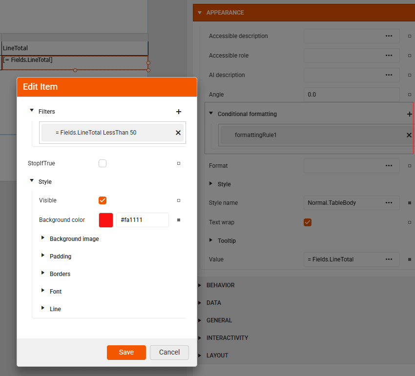
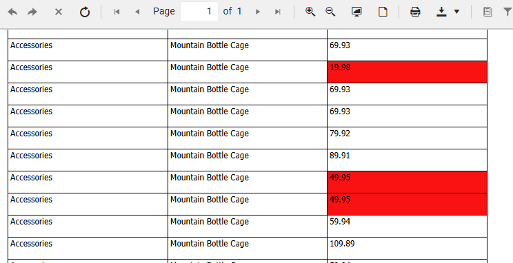

# Conditional Formatting 

To visually highlight important data, **Conditional formatting** lets you automatically style report items based on the values they display making your reports more dynamic and easier to read. For example, you can set a TextBox showing revenue to turn red if the value drops below 10,000. This helps draw attention to numbers that need review or action.

>caption Applying a Conditional Formatting Rule

    

  

## Formatting a Single Item

Watch this quick tutorial to learn how to apply conditional formatting to a LineTotal TextBox in a table - changing its color to red when the *value is less than 50*:

<iframe width="560" height="315" src="https://www.youtube.com/embed/gU749jR899U?si=RrgBdmOvMVWKH-I8" title="YouTube video player" frameborder="0" allow="accelerometer; autoplay; clipboard-write; encrypted-media; gyroscope; picture-in-picture; web-share" referrerpolicy="strict-origin-when-cross-origin" allowfullscreen></iframe>

## Formatting Multiple Items 

While conditional formatting works great on individual items, applying it to multiple selected items at once is a challenge. When **multiple** items are selected, even though ConditionalFormatting is technically supported on each individual item, the designer cannot guarantee consistent behavior across all selected items. Hence, it does not allow batch editing of conditional formatting rules to make for example alternating row style for all the cells belonging to the table row. It requires you to apply rules **individually** to each item:
* Select each TextBox (or other report item) one at a time.
* Add the same conditional formatting rule manually.

To save time, you can group items inside a Panel and apply the conditional formatting to the panel itself. This way, all nested items inherit the style based on the condition. This approach is shown in the following video: 

<iframe width="560" height="315" src="https://www.youtube.com/embed/oise1nWPJ0I?si=3yaiqnIwZxoJgdKO" title="YouTube video player" frameborder="0" allow="accelerometer; autoplay; clipboard-write; encrypted-media; gyroscope; picture-in-picture; web-share" referrerpolicy="strict-origin-when-cross-origin" allowfullscreen></iframe>

## See Also

* [Web Report Designer]()
* [Styling the Report]()
