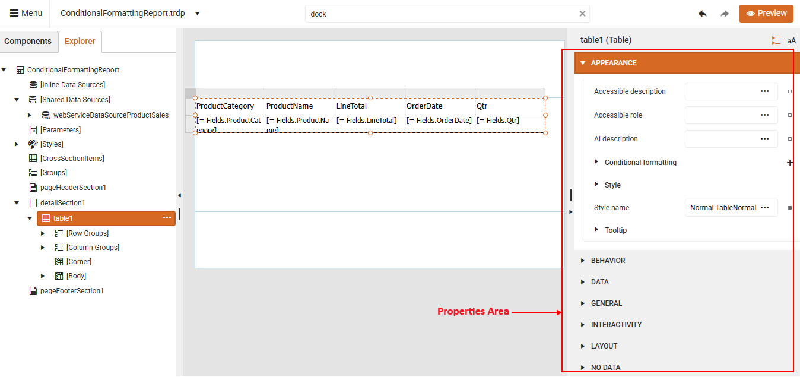
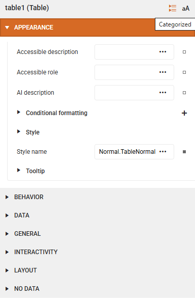
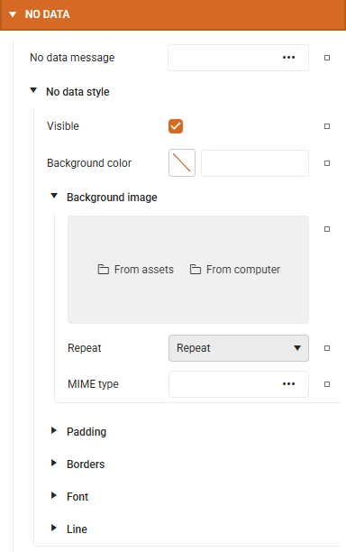
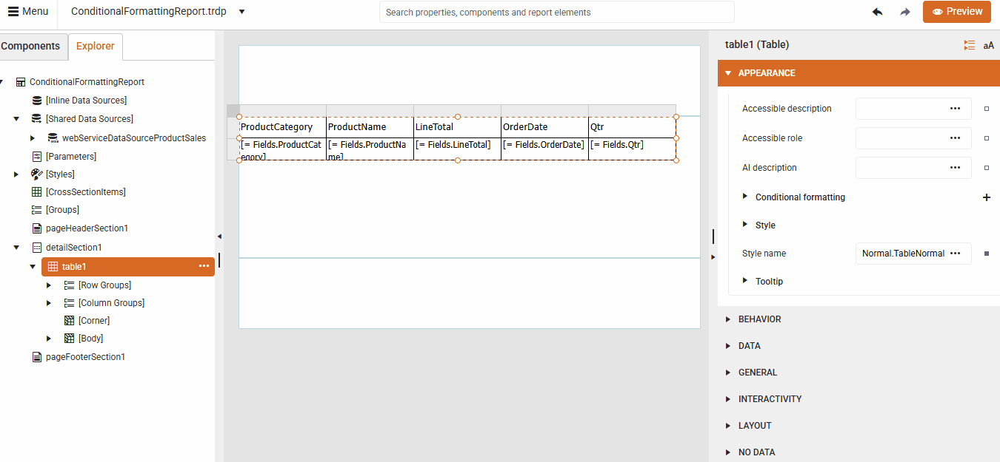
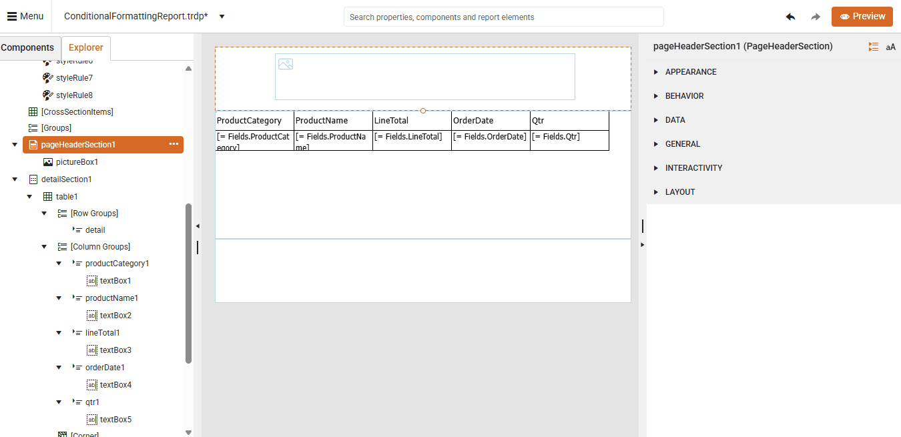

# Customizing Report Items

A well-styled report looks professional and polished. Styling report items serves both, functional and aesthetic, purposes. Visual consistency (e.g., using a theme or style rules) improves user experience and brand alignment. It allows you to improve readability and clarity in your reports. Applying different colors or fonts distinguishes separate sections or highlight key information.
To customize or style report items in the Telerik Web Report Designer, you can use its built-in CSS-like styling model and the Properties panel.

## Properties Area

The **Properties Area** on the right side of the Web Report Designer **dynamically** displays the properties of the **currently selected** report item - such as a TextBox, Table, Chart, or Panel.

  

Key Features of the Properties Area are:

* **Categorized** and **Alphabetical** Views for easier navigation:

|Categorized|Alphabetical|
|----|----|
| ||

* **Indent Line Guides**: These help visualize the hierarchy of nested properties, improving clarity: 

  

* **Global Search**: A search bar at the top allows you to quickly find specific properties or editors.

   

### Reset Button in the Properties Area

Each editable property in the Properties Area has a small square button next to it - this is the **Reset** button. It reverts the property to its `default` value which is useful when you have applied multiple changes and want to undo a specific one without affecting others. The Reset button helps maintain consistency, especially when working with styles or templates.

    

## See Also

* [Web Report Designer]()
* [Conditional Formatting]()
* [Stylesheet Formatting]()
