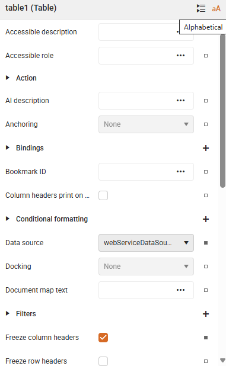

# Customizing Report Items - Overview

Styling report items serves both, functional and aesthetic, purposes. Visual consistency (e.g., using a theme or style rules) improves user experience and brand alignment. It allows you to improve readability and clarity in your reports. Applying different colors or fonts distinguishes separate sections or highlight key information.
To customize or style report items in the Telerik Web Report Designer, you can use its

* [Confitional Formatting]() option
* Built-in CSS-like [styling model]()
* Properties Area.

## Properties Area

The **Properties Area** represents the section on the right-side where you can view and edit the properties of the currently selected report item. This area lets you control how each report item looks and behaves. Whether you are working with a TextBox, Table, Chart, or Image, this panel gives you access to all the relevant settings in one place:

* **Appearance**: Change fonts, colors, borders, background, padding, and more. Apply [conditional formatting](): dynamically change appearance based on data values.
* **Data**: Connect report items to fields or expressions from your data source.
* **Layout**: Modify size, position, alignment, and visibility.
* **Behavior**: Set actions like navigation, visibility rules, or interactivity.

   

### Key Features

The Properties Area in the Web Report Designer is designed to make customizing your report items smooth and intuitive. Here’s how it helps you work smarter:

* **Different Views**: Choose the layout that fits your style:

  * **Categorized View**: Groups properties by function (like Appearance, Layout, Data), making it easier to find what you need.
  * **Alphabetical View**: Lists everything in order - perfect if you know exactly what you're looking for.

|Categorized|Alphabetical|
|----|----|
| ||

* **Indent Guides**: In case of nested properties Indent Line Guides help you see how settings are structured, so you can navigate complex items with confidence: 

  

* **Search Box**: Use the Global Search bar at the top to instantly locate any property or editor. No more scrolling through long lists!

   

* **Reset Value**: If you have made a change you want to undo, note that each editable property has a `Reset button` next to it. Just click it to revert that setting to its default - without affecting anything else.

    

## See Also

* [Conditional Formatting]()
* [Stylesheet Formatting]()
