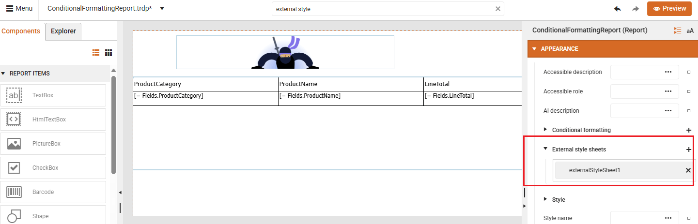
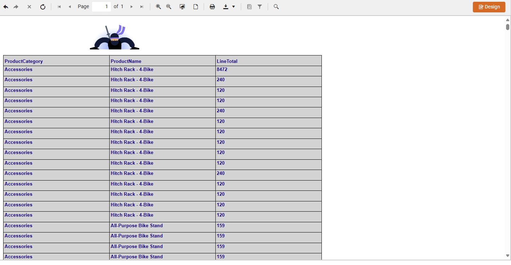

<style>
img[alt$="><"] {
  border: 1px solid lightgrey;
}
</style>

# StyleSheet Formatting

To apply formatting via external stylesheets, you can use a CSS-like styling model that allows centralized and reusable styling across multiple report items. 

## Creating a StyleSheet

In the Web Report Designer:

1. Select the **Report** object.

1. Go to the StyleSheet property.

1. Click the `+` button to open the **StyleRule Collection Editor**.

1. Click Add to create a new StyleRule.

1.Define the Style (e.g., background color, font, borders).

1. Add Selectors to target specific items (e.g., all TextBox, PictureBox items).

The following tutorial shows how to define a StyleRule in the report's StyleSheet and apply the style to multiple items using selectors (e.g., by item name or type):

<iframe width="560" height="315" src="https://www.youtube.com/embed/HIjkZc48abM?si=aUZKq7TlyfuwBIp2" title="YouTube video player" frameborder="0" allow="accelerometer; autoplay; clipboard-write; encrypted-media; gyroscope; picture-in-picture; web-share" referrerpolicy="strict-origin-when-cross-origin" allowfullscreen></iframe>

## Applying Formatting via External Stylesheets


An external StyleSheet is an XML file that contains StyleRules. These rules define how report items should look - similar to CSS in web development. You can apply styles based on:

* **TypeSelector**: Applies to all items of a specific type (e.g., all TextBox items).
* **AttributeSelector**: Applies to items with specific attributes.
* **StyleSelector**: Applies to items with a specific StyleName.
* **DescendantSelector**: Applies to items nested within others.

In the Web Report Designer:

1. Select the **Report** object.

1. Go to the **External style sheets** property.

1. Click the `+` button to add an external StyleSheet.

An external style sheet can be define with:

* **Absolute** Path/URL: for example *C:\Application1\StyleSheets\StyleSheet1.xml* or *https://www.mysite.com/Application1/StyleSheets/StyleSheet1.xml*
* **Relative** Path/URL: for example *.\StyleSheets\StyleSheet1.xml* or *~/StyleSheets/StyleSheet1.xml*

 

A sample rule is demonstrated below. This rule applies to all TextBox items and sets a light gray background, dark blue text, and bold Arial font.

```XML

<StyleSheet>
<StyleRule>
  <Selectors>
    <TypeSelector Type="Telerik.Reporting.TextBox" />
  </Selectors>
  <Style>
    <BackgroundColor>LightGray</BackgroundColor>
    <Color>DarkBlue</Color>
    <Font>
      <Name>Arial</Name>
      <Size>10pt</Size>
      <Bold>true</Bold>
    </Font>
  </Style>
</StyleRule>
</StyleSheet>

```
Once applied to a report, the preview looks like: 

  


## See Also

* [Web Report Designer]()
* [Styling the Report]()
