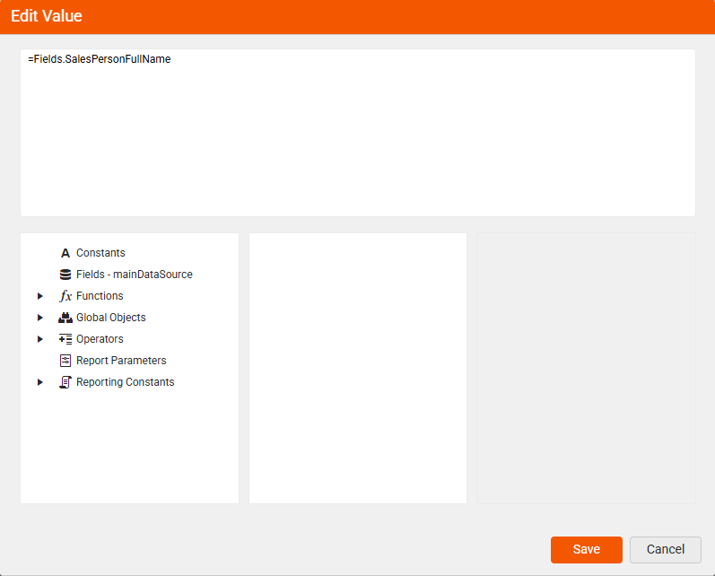
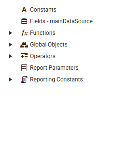

<style>
img[alt$="><"] {
  border: 1px solid lightgrey;
}
</style>

# Customize Report Behavior Using the Expression Editor

Instead of manually entering fixed values, you can use expressions to make your report items smarter and more dynamic. This means your reports can automatically adapt to changing data or conditions—saving you time and reducing errors. The expression editor helps you build these expressions easily, offering ready-to-use elements and clear descriptions so you can focus on getting the result you need without digging through documentation.

Quickly build your pricing logic by combining database fields with custom values—just type your formula or double-click elements to add them. This helps you calculate extended prices effortlessly and accurately.



## Designing Expressions with Built-in Elements

Build flexible expressions with minimal effort by using predefined components, eliminating the need for manual coding.



| Name | Description |
| ------ | ------ |
| `Constants` | Use fixed values like numbers, text, dates, and booleans to ensure consistent logic and formatting that stays unchanged during report execution |
| `Fields – mainDataSource` | Represent the actual data columns from your connected data source |
| `Functions` | Predefined formulas that perform calculations or logic using values like fields, constants, or other functions to create dynamic expressions |
| `Global Objects` | Built-in objects that provide access to report-wide information such as current user identity, execution time, page numbers, rendering format, and environment details |
| `Operators` | Symbols used in expressions to perform calculations, comparisons, logic, or string operations—like +, =, AND, or LIKE. |
| `Report Parameters` | User-defined inputs that control report content, filtering, or layout—often used to pass values, filter data, or link related reports |
| `Reporting Constants` | Predefined values used to control report layout and styling—such as alignment, borders, image sizing, and page behavior |

### Using the Expression Editor

<iframe width="560" height="315" src="https://www.youtube.com/embed/mDMxH0uJJk8?si=TQvK4rxpGw6OGkz7" title="YouTube video player" frameborder="0" allow="accelerometer; autoplay; clipboard-write; encrypted-media; gyroscope; picture-in-picture; web-share" referrerpolicy="strict-origin-when-cross-origin" allowfullscreen></iframe>

>tip You may add a new line as a string in the Expression with the `Edit Expression` dialog.
>
>````
>= Fields.FirstLine + "
>" + Fields.SecondLine
>````
>
>The result will be the values of the two fiels being displayed one above the other in the corresponding report item.

## See Also

* [Functions Overview]()
* [Data Sources]()
* [Approaches for Adding Report Parameters](#web-report-designer)
* [Aggregate Functions Overview]()
