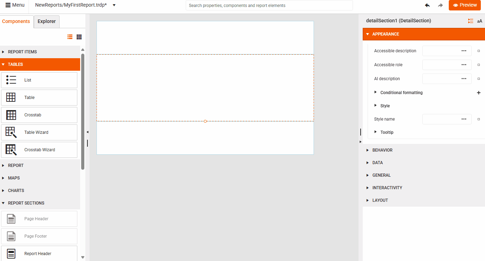

# Getting Started 

This video tutorial will guide you through the first steps of creating a report from scratch by using the Telerik Web Report Designer.

## Before You Start

Make sure you have access to:

* Your company's instance of the Telerik Web Report Designer.
* A data source that will feed the report with data. For the purpose of this tutorial, you can utilize a data source provided by Telerik. However, you can use virtually any data source, for example, a web service, SQL, CSV, GraphQL, [and more](data-sources-link).

## Creating the Report and Connecting It to Data

The video below will guide you through the following steps:

1. Creating a new report and saving it to the desired location.
1. Connecting the report to a web service data source.

>tip To learn more about the additional options, see the [advanced data source options](#advanced-data-source-options) below.

<iframe width="560" height="315" src="https://www.youtube.com/embed/VQQxKL2sbvc?si=U6ca4GCX3uB_NV-a" title="YouTube video player" frameborder="0" allow="accelerometer; autoplay; clipboard-write; encrypted-media; gyroscope; picture-in-picture; web-share" referrerpolicy="strict-origin-when-cross-origin" allowfullscreen></iframe>

## Add a Report Component

Now that you created a report and connected it to data, you can start adding report items, for example, a table:

1. On the Design Surface, click the report's **Detail section**&mdash;the main content area of the report. Clicking the section allows you to add report items to it.

1. Go to the **Components** tab and select [**Table Wizard**]() from the **TABLES** section.

    

1. Configure the table.

    

1. Style the Table using the [Properties Area]().

    

1. Congratulations! Click the **Preview** button at the top right corner to see your first report with a table, populated with data coming from a web service. The tollbar allows you to easily export the report to the desired [format]():

      

## Advanced Data Source Options

If you need to provide additional configuration options for your report's data source, you can do this in the data source wizard while you create the report. The advanced options let you:

* Configure request parameters.

* Choose what data to use while designing the report:

  * Use real data while designing the report.
  * Upload a JSON file.
  * Use JSON inline as hard-coded data while designing the report.

* Preview the data received from the data source.

## See Also

* [Web Report Designer]()
* [WebServiceDataSource]()
* [WebServiceDataSource Wizard]()
