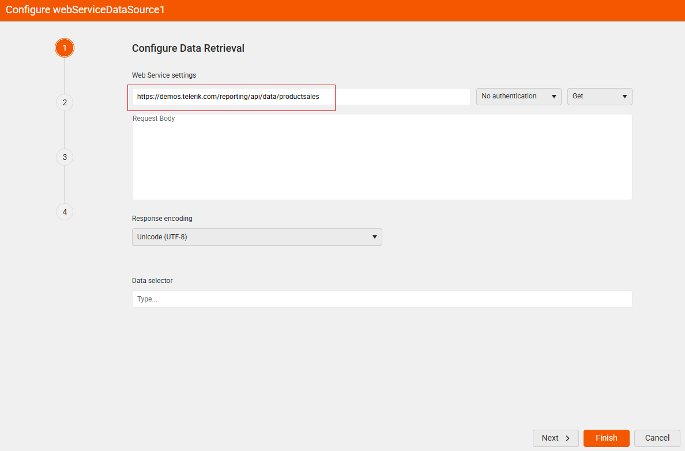
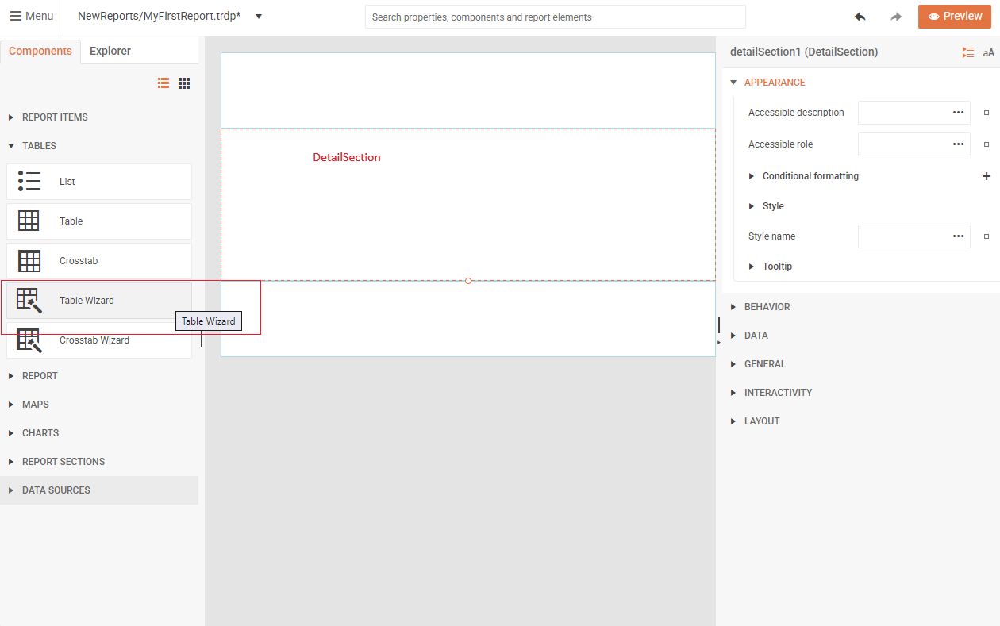
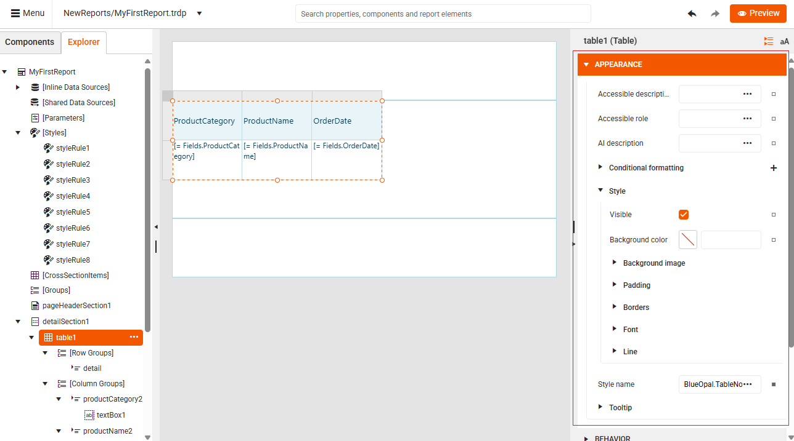

# Getting Started

This tutorial will guide you through your first steps of creating a report from scratch using the Web Report Designer. By the end of this tutorial, you will have created a basic report with a table that displays data from a web service.

## What You'll Build

In this tutorial, you'll create a simple report that:

* Connects to a Telerik demo web service
* Displays data in a formatted table
* Can be previewed and exported

## Before You Start

Make sure you have access to:

* Your company's instance of the Telerik Web Report Designer.
* A data source to feed the report with data. For this tutorial, you can use a data source provided by Telerik. However, you can use virtually any data source, for example, a web service, SQL, CSV, GraphQL, [and more]().

## Creating the Report and Connecting It to Data

1. Create a new empty report by clicking **New Report** in the main menu:

    

1. On the **Components** tab, go to [Data Sources]() and select **Web Service Data Source**:

      

1. On the **Configure Data Retrieval** screen, enter the URL of the web service providing the data for your report: `https://demos.telerik.com/reporting/api/reports/formats`, and then click **Finish**.

    

Now you have a blank report that is connected to data.

## Adding Items to Your Report

Next, design the report by adding a Table report item to display your data.

1. Click the report's **Detail Section** to enable adding report items.

1. Select the **Components** tab, and then click the [**Table Wizard**](#using-the-table-wizard) button:  

    

1. Configure the Table as illustrated in the animation below. Select the data fields you want to display and arrange them in the table columns:

      

1. (Optional) Style the Table using the **APPEARANCE** options in the Properties panel:

    

1. Click the **Preview** button in the top-right corner to see your completed report with a table populated with data from the web service:

    

Congratulations! You have successfully created your first report with the Web Report Designer.

## Next Steps

Now that you've created your first report, you can:

* Add more [report items]() like charts, images, or text boxes
* Explore different [data source types]()
* Learn about [report sections]() to organize your content
* Apply advanced formatting and styling options

## Video Tutorial

For a visual walkthrough, watch this video tutorial that demonstrates creating a report with a chart. The video covers the Visual Studio setup initially, but the Web Report Designer portion starts at the 3:08 mark:

<iframe width="560" height="315" src="https://www.youtube.com/embed/L-utkcB8-5c?si=bmJU9ggpSOykHdLK&amp;start=188" title="YouTube video player" frameborder="0" allow="accelerometer; autoplay; clipboard-write; encrypted-media; gyroscope; picture-in-picture; web-share" referrerpolicy="strict-origin-when-cross-origin" allowfullscreen></iframe>

## See Also

* [Getting Started Video Tutorial Part 1](https://www.youtube.com/embed/L-utkcB8-5c?si=bmJU9ggpSOykHdLK&amp;start=188)
* [Getting Started Video Tutorial Part 2](https://www.youtube.com/watch?v=DXKlgq-MYIU)
* [Web Report Designer]()
* [WebServiceDataSource]()
* [WebServiceDataSource Wizard]()
