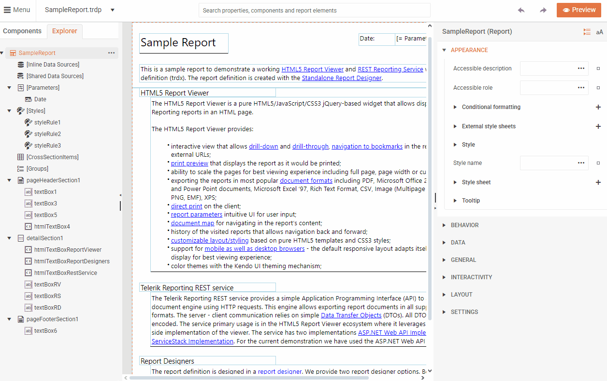

# Getting Started 

This tutorial will guide you through your first steps of creating a report from scratch using the Web Report Designer.

## Before You Start

Make sure you have access to:

* Your company's instance of the Telerik Web Report Designer.
* A data source that will feed the report with data. For the purpose of this tutorial, you can utilize a data source provided by Telerik. However, you can use virtually any data source, for example, a web service, SQL, CSV, GraphQL, [and more]().

## Creating the Report and Connecting It to Data

1. Create a new empty Report:

    

2. On the **Components** tab, go to [Data Sources]() and select **Web Service Data Source**:

      

3. On the **Configure Data Retrieval** screen, enter the URL of the web service providing the data for your report, for example, `https://demos.telerik.com/reporting/api/reports/formats`, and then click **Finish**.

    

Now you have a bank report that is connected to data.

## Adding Items to Your Report

Next, design the report by adding a Table report item:

1. Click the report's Detail Section to enable the adding of report items.

1. Select the **Components** tab, and then click the [**Table Wizard**]() button:  

    

1. Configure the Table as illustrated below:

      

1. If desired, style the Table using **APPEARANCE** options in the Properties pane:

    

1. Click the **Preview** button at the top right corner to see your first report with a table populated with data coming from a web service.

      

## Video Tutorials

If you prefer video, check out the Getting Started tutorial below. It demonstrates how to create a report and add a Chart. Make sure to skip the setup in Visual Studio and start with the creation of the report at [3:08](https://www.youtube.com/embed/L-utkcB8-5c?si=bmJU9ggpSOykHdLK&amp;start=188).

<iframe width="560" height="315" src="https://www.youtube.com/embed/L-utkcB8-5c?si=bmJU9ggpSOykHdLK&amp;start=188" title="YouTube video player" frameborder="0" allow="accelerometer; autoplay; clipboard-write; encrypted-media; gyroscope; picture-in-picture; web-share" referrerpolicy="strict-origin-when-cross-origin" allowfullscreen></iframe>

## See Also

* [Getting Started Tutorial Part 1](https://www.youtube.com/embed/L-utkcB8-5c?si=bmJU9ggpSOykHdLK&amp;start=188)
* [Getting Started Tutorial Part 2](https://www.youtube.com/watch?v=DXKlgq-MYIU)
* [Web Report Designer]()
* [WebServiceDataSource]()
* [WebServiceDataSource Wizard]()
