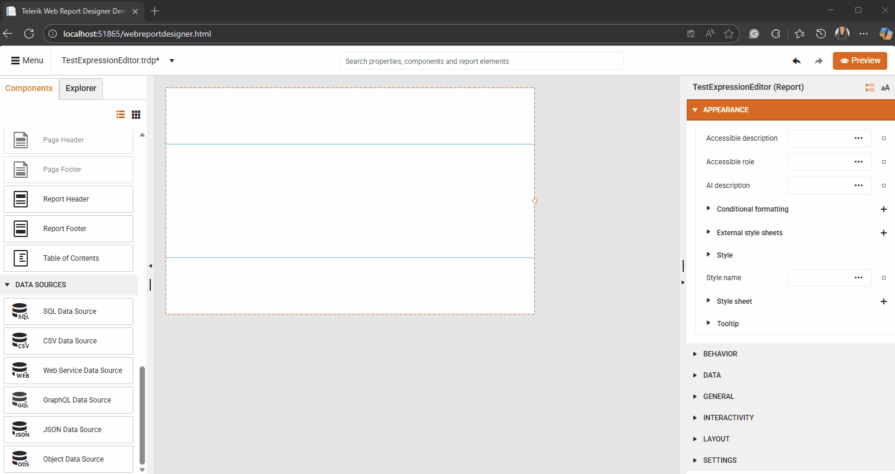

<style>
img[alt$="><"] {
  border: 1px solid lightgrey;
}

</style>

# Web Report Designer – Query Builder for Easy Data Selection

The Web Report Designer gives you two easy ways to build queries: a visual tool (where you click and select options) and a text tool (where you type the query). A query is just a set of instructions that tells the system what data you want from a database. This data is used by something called a SqlDataSource, which connects your report to the database. The Query Builder works with most common data providers (like ADO.NET, ODBC, or OLEDB) as long as they can share details about the columns in the database using a feature called `GetSchema`.


The graphical query builder helps you find information in a database without writing code. You can click to choose the tables and columns you need, and then see the results. If you use more than one table, you need to show how the tables are connected.

## Schema Restrictions

As of 2025 Q1, the Web Report Designer’s Query Builder has a new option called [Schema Restrictions](/api/telerik.reporting.sqldatasource#Telerik_Reporting_SqlDataSource_SchemaRestrictions). This option lets you choose which parts of the database to load by listing them with commas. It helps report creators see only the needed information and makes loading faster.

````
null,Production,ProductCategory
````

> Schema restrictions are sensitive to uppercase and lowercase letters, and empty values are allowed. If you need to set a value to nothing, use the word null as shown in the example. These rules only work with .NET 8 or newer.


## Query Builder Areas

The following sections describe the function of each area

| Name | Description |
| ------ | ------ |
| [Database View](#database-view-pane) | Displays a structured list of tables and views grouped by database sections |
| [Selected Fields](#selected-fields-pane) | Displays the list of field names from the selected items in the database view |
| [Relationships](#relationships-pane) | Displays how the selected tables are connected |
| [Filters](#filters-pane) | Displays a list of options you can use to filter tables or views |
| [Result](#result-pane) | Displays example data for the query that was created automatically |

### Database View Pane

On the left side of the screen, you’ll see the Database View. It shows details about the database items you’re allowed to access, based on your login. The items are organized in a tree structure by category. Click a category to see its tables and views, and click a table or view to see its columns.

When you check a column in this pane, it will automatically move to the Selected Fields pane. If you check a table, all its columns will be added to the Selected Fields pane. If you check more than one table, the Relationship Editor pane will open automatically.

### Selected Fields Pane

The Selected Fields pane shows the columns you chose to include in your query. These columns become the set of fields used for your report. You can use these fields to display data in tables, charts, and other report elements when viewing the report.

The following columns are displayed:

| Name | Description |
| ------ | ------ |
| Column name | Displays the names of the selected fields, grouped by the table or view they come from |
| Alias | If the last added field name is already used, an alias will be created automatically. You can also change or add aliases manually |
| Grouped | Displays a checkbox that lets you choose if the field should be used for grouping |
| Aggregate | Displays the calculation that will be applied to the field. You can choose `Count`, `Max`, `Min`, `Average`, or `Sum`. If a field is grouped, it cannot have a calculation. By default, `Sum` is used for all fields that are not grouped when the `Grouped` checkbox is selected |
| Sorting type | Displays the sorting type for the field. You can choose `(none)`, `Ascending` (A to Z or smallest to largest), or `Descending` (Z to A or largest to smallest). By default, `(none)` is selected, which means the field will not be sorted |
| Sort order | Displays the order in which the field sortings should be applied |
| Remove | Includes a button to remove this field from the query. You will be asked to confirm before the field is deleted |

### Relationships Pane

The Relationships pane shows how the selected tables are linked together, using SQL JOIN statements (which are instructions that tell the database how to combine data from different tables).

The following option is available:

* __Add new relationship__ Opens the relationship editor, which lets you set up connections between tables or views. These relationships tell the system how to combine data. When using multiple relationships in a query, each new table must be related to one that is already included.

The following columns are available:

| Name | Description |
| ------ | ------ |
| Left table | Displays the name of the first table that is part of the join relationship |
| Join type | Displays the type of SQL join used in the automatically created query. The join types you can choose from are `Inner`, `Left`, `Right`, `Outer`, and `Unrelated` |
| Right table | Displays the name of the second table that is part of the join relationship |
| Left table field | Displays which field from the left table will be used to match data in the join statement |
| Operator | Displays the operator used on the left and right fields from the joined tables |
| Right table field | Indicates which field from the right table should be used in the join statement |
| Edit/Remove | Contains buttons to edit or remove the current relationship |

### Filters Pane

The Filters pane shows the conditions used to narrow down the data you see. These conditions help the system choose only the rows that match and create a rule for finding them.

The following option is available:

| Name | Description |
| ------ | ------ |
| Logical operator | Choose how the filters in this group should work together. The available options are `And` and `Or` |
| Add Expression | Add a new filter expression to the current group |
| Add Group | Add a new filter group that can have a different logical operator. Filter groups can be defined hierarchically |
| Close | Remove the current filter group and all of its child filter expressions |

The following columns are displayed:

| Name | Description |
| ------ | ------ |
| Field Name | Displays the name of the field to apply the criteria |
| Operator | The operator to use in the filter expression |
| Value/Parameter name | The value or parameter name to add to the query |
| Preview value | The value to use for the Result pane |
| Delete | Remove the current filter expression from the expression group |

### Result Pane

The Result pane shows the query that is created based on your choices in the other sections. It can also give you a preview of the data that will appear when the query runs. The columns you see in the results are the fields you selected earlier.

The report does not store the actual data. The data is only fetched when the report is generated.

The following options are available:

* __Preview button__ Preview the query created from your selections or see the data it will return

* __SQL/Data switch__ Choose whether to preview the SQL query that was created for you or the data it will return.



## Query Builder State

When you click Save, the [SqlDataSource Wizard]() Select Statement will be replaced by the new SQL query that was generated.

The Query Builder keeps your current settings. But if you change the SQL query manually and then use the Query Builder again, it will replace your changes with its own version.

## See Also

* [Getting Started Video Tutorial Part 1](https://www.youtube.com/embed/L-utkcB8-5c?si=bmJU9ggpSOykHdLK&amp;start=188)
* [Getting Started Video Tutorial Part 2](https://www.youtube.com/watch?v=DXKlgq-MYIU)
* [Web Report Designer]()
* [WebServiceDataSource]()
* [WebServiceDataSource Wizard]()
