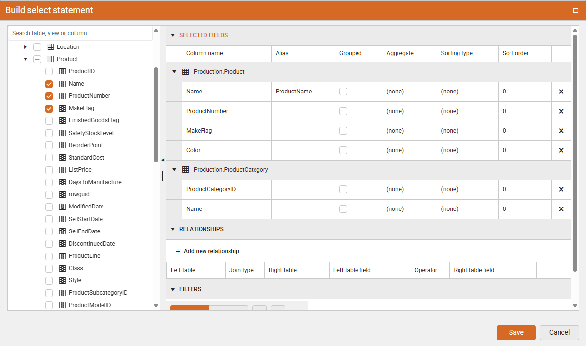
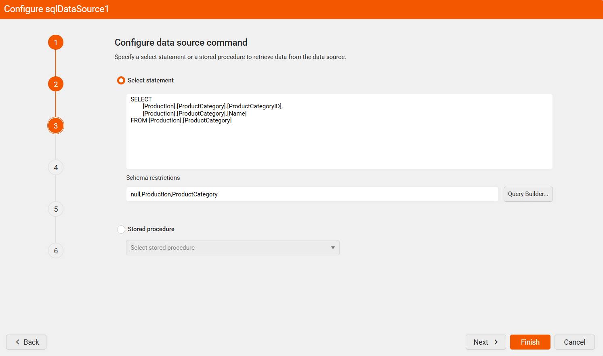
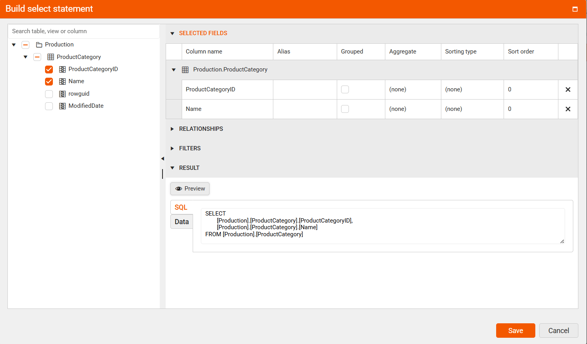

<style>
img[alt$="><"] {
  border: 1px solid lightgrey;
}

</style>

# Web Report Designer – Query Builder for Easy Data Selection

The Web Report Designer gives you two easy ways to build queries: a visual tool (where you click and select options) and a text tool (where you type the query). A query is just a set of instructions that tells the system what data you want from a database. This data is used by something called a SqlDataSource, which connects your report to the database. The Query Builder works with most common data providers (like ADO.NET, ODBC, or OLEDB) as long as they can share details about the columns in the database using a feature called `GetSchema`.



The graphical query builder helps you find information in a database without writing code. You can click to choose the tables and columns you need, and then see the results. If you use more than one table, you need to show how the tables are connected.

## Schema Restrictions

As of 2025 Q1, the Web Report Designer’s Query Builder has a new option called [Schema Restrictions](/api/telerik.reporting.sqldatasource#Telerik_Reporting_SqlDataSource_SchemaRestrictions). This option lets you choose which parts of the database to load by listing them with commas. It helps report creators see only the needed information and makes loading faster.

````
null,Production,ProductCategory
````

> Schema restrictions are sensitive to uppercase and lowercase letters, and empty values are allowed. If you need to set a value to nothing, use the word null as shown in the example. These rules only work with .NET 8 or newer.





## Query Builder Areas

The following sections describe the function of each area

| Name | Description |
| ------ | ------ |
| [Database View](#database-view-pane) | Displays a structured list of tables and views grouped by database sections |
| [Selected Fields](#selected-fields-pane) | Displays the list of field names from the selected items in the database view |
| [Relationships](#relationships-pane) | Displays how the selected tables are connected |
| [Filters](#filters-pane) | Displays a list of options you can use to filter tables or views |
| [Result](#result-pane) | Displays example data for the query that was created automatically |

### Database View Pane

### Selected Fields Pane

### Relationships Pane

### Filters Pane

### Result Pane
