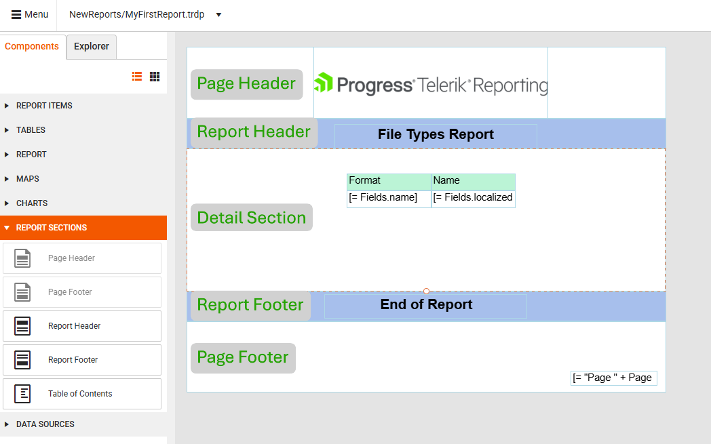

# The Basic Structure of a Report

Each report consists of sections that divide the report vertically and [report items](#report-items) that you place in each section. A report section represents a specific area on the report page and defines what items can be placed in that area and how these items will appear.

By default, every new report you create has three sections:

* Page Header
* Page Footer
* Detail section (the main content area of the report)

In addition to the default sections above, you can also add:

* Table of Contents (TOC)
* Report Header
* Report Footer
* Report Groups
* Group Header
* Group Footer

## Page Header

The Page Header section is printed at the top of every page. In reports with multiple pages, you can use the Page Header to place the same content at the beginning of every page, for example, the report title.

>The Page Header can display only the content that fits within the boundaries of the section. Any content that doesn't fit within the section will be clipped.

## Page Footer

The Page Footer section appears at the end of every page. Use the Page Footer to print page numbers or page-specific information. You can hide the Page Footer on pages of your choice, for example, on all even pages or on the first and last page of the report. By hiding this section, you can free page space for the rest of the report content.

## Detail Section

The Detail section displays the detailed information and is printed once for every row in the data source. This is where you place the report items that constitute the main body of the report.

## Report Items

[Report items]() are the individual elements or components that make up a report. They display various types of report data, such as barcodes, charts, tables, and so on. A sales report, for example, may contain the following items:

* Text boxes displaying the report title, date, and other descriptive information.
* Images representing the company logo or brands.
* Charts showing sales data, such as product sales by region.

## Table of Contents

The Table of Contents (TOC) is a list that contains links to the report items along with their page numbers. Clicking a link in the TOC takes the user to the page that contains the specified report item. You can display the TOC before or after the Report Header or Report Footer.

For a sample report with a TOC, see the [Product Catalog Report Demo](https://demos.telerik.com/reporting/product-catalog).

## Report Header

Use the report header to place information typical for a cover page, such as logos, titles, or dates. The Report Header section is printed once, at the beginning of the report:

* If you place a Page Header on the first page, the Report Header will appear after it.
* If the report has a TOC section, you can place it before or after the Report Header.

## Report Footer

Use the report footer to print report totals or other summary information for the entire report. The Report Footer section is printed once at the end of the report:

* If you place a Page Footer on the last page, the Report Footer will appear before it.
* If the report has a TOC section, you can place it before or after the Report Header.

## Report Groups

Report groups allow you to visually separate logically related data sets. To show the group boundaries and display introductory and summary information for each group, you can use group header and footer sections. For example, you can use different report groups to represent the detailed sales data for each region, and the group header may contain the name of the region while the footer can contain the total number of sales for that specific region.

## Group Header

The Group Header section is printed at the beginning of each new group of records. Use the group header to print the group name. For example, in a report that is grouped by product, use the group header to print the product name.

## Group Footer

The Group Footer section is printed at the end of each group of records. Use a group footer to print a summary related to the group.

## Next Steps

* [Create Your First Report]()
* [Explore the Report Components]()
* [Connect Your Report to Data]()
