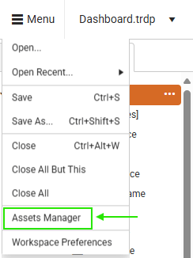

# Sharing and Reusing a Data Source

Instead of configuring a data connection every time you build a report, the Shared [Data Source]() component lets you set it up once and reuse it across multiple reports. This saves you time, reduces errors, and keeps your data connections consistent. Whether you're pulling data from a database, a file, or a web service, this approach helps you stay organized and efficient.

You can easily connect your reports to a variety of data sources — giving you flexibility to work with the formats you already use, such as:

  * [SqlDataSource](#sql-data-source%})
  * [WebServiceDataSource](#web-service-data-source%})
  * [ObjectDataSource](#object-data-source%})
  * [JsonDataSource](#json-data-source%})
  * [CsvDataSource](#csv-data-source%})

## Configuring a Shared Data Source

1. Once your report is ready, open it in the Web Report Designer.
1. To create a `Shared Data Source`, locate an existing data source in the Web Report Designer. Click the ellipsis button (...) next to the data source and select "Save as Shared Data Source" from the context menu.

 

1. After saving a data source as shared, the Web Report Designer generates a .sdsx file. This file represents the shared data source definition and can be opened directly in the designer for further configuration.

 

1.To view all Shared Data Sources, open the [`Assets Manager`](#assets-manager) from the main menu.

 

 ###Creating Shared Data Source

 <iframe width="560" height="315" src="https://www.youtube.com/embed/iLBt_8EyxBI?si=kx6LnA1m_FC-r3xA" title="YouTube video player" frameborder="0" allow="accelerometer; autoplay; clipboard-write; encrypted-media; gyroscope; picture-in-picture; web-share" referrerpolicy="strict-origin-when-cross-origin" allowfullscreen></iframe>

## Difference Between Shared Data Source and Data Source

In the Web Report Designer, both Data Source and Shared Data Source are used to define connections to external data. However, they differ in scope, usage, and maintainability.

| Data Source | Shared Data Source |
| ------ | ------ |
| Defined within a single report | Defined outside of individual reports and stored as a .sdsx file |
| Cannot be reused across other reports | Can be reused across multiple reports |
| Changes to the data source affect only the report where it is defined | Changes to the shared data source affect all reports that reference it |
| Suitable for simple or one-off reports | Ideal for centralized data management and large-scale reporting solutions |

## See Also

* [Web Report Designer User Guide: An Overview]()
* [App Tour of the Web Report Designer]()
* [Create a Simple Report]()
