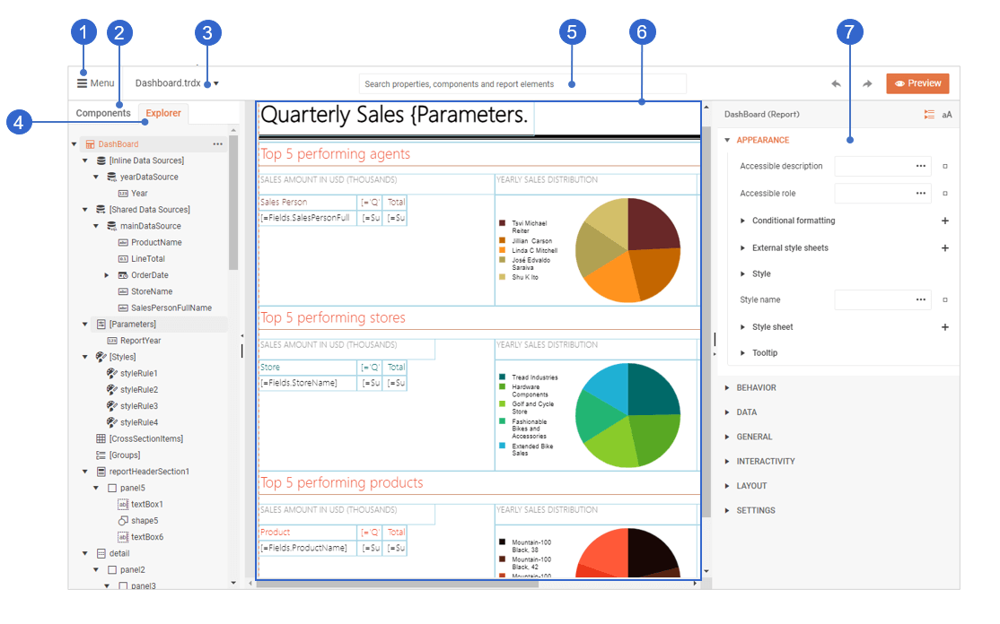

# Web Report Designer User Guide: An Overview

The Web Report Designer User Guide is intended to assist the end-users of business applications that integrate [Telerik Reporting](). This guide aims to provide the knowledge required for the successful crafting and maintenance of reports. The primary audience for this user guide are business application users.

> If you are a developer who integrates Telerik Reporting into web applications, see the [application developer section]() of the Web Report Designer documentation or the [Getting Started tutorial](). 

## What is the Web Report Designer?

The Web Report Designer is a tool developed to let business application users design, create, and export reports directly in their web browser without needing any additional software. The reports can source their data from various databases, for example, relational, multi-dimensional, ORM, or custom data-layer-based data sources.

1. Main menu—allows you to open or close reports, create new ones, access workspace-related preferences and more.
1. Components tab—provides access to all components that you can include in you report, for example, items, tables, charts, sections and others.
1. Currently opened report—allows you to switch between the opened reports.
1. Explorer tab—represents the structure of the report as a tree.
1. Search box—enables the quick access to report items and components.
1. Design surface—represents the layout of the report.
1. Properties area—provides access to the properties of the currently selected report component.

## What's in this User Guide?

This user guide includes articles that describe common scenarios related to the design and configuration of reports. In addition, you will also find conceptual information and videos that illustrates basic reporting principles, for example, how to [structure a report]().

## Next Steps

* [Take an App Tour]()
* [Create a Simple Report]()
* [Explore the Structure of a Report]()




