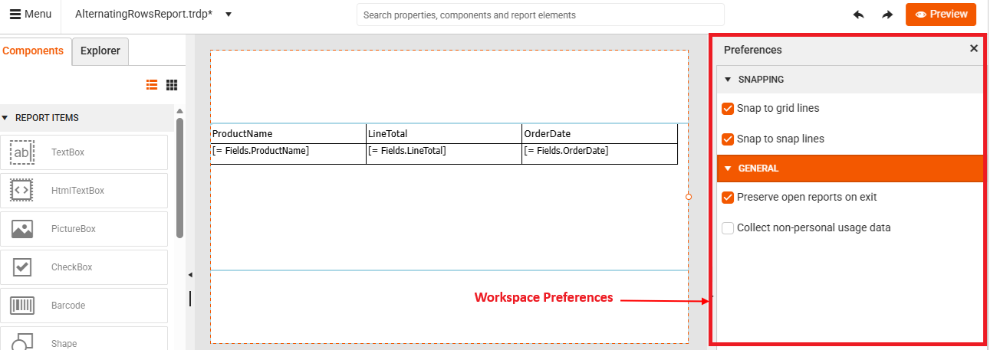
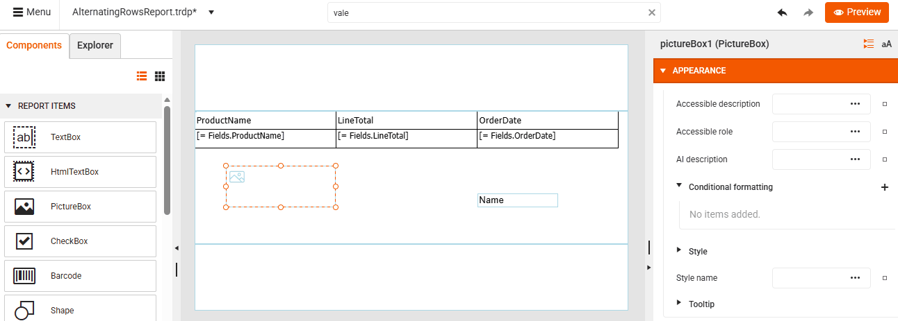

# Adjusting User Preferences in Web Report Designer

The **Workspace Preferences** section provides options to personalize the designer interface without affecting the actual report content. These settings are user-specific and typically stored in the browser or session.

To start the Preferences panel:

1. Launch the Web Report Designer in your browser.

1. Click the **Main Menu** at the top left corner.

1. Select "Workspace Preferences" from the menu options:

     

The Workspace Preferences offer the following main categories of settings:

## Snapping

* **Snap to grid lines** (*Currently Not Supported*)—Snapping to grid lines means that when you move or resize report items (like TextBoxes, Tables, Charts) on the design surface, their edges automatically align to the nearest grid line. 

    The design surface has an invisible or visible grid. When snapping is enabled:

    * Moving an item → It jumps to the nearest grid intersection.
    * Resizing an item → Edges align with grid lines.

    When disabled: You can freely position items without restrictions.

* **Snap to snap lines**—Helps you position elements relative to each other (e.g., aligning text boxes, charts, or tables). Snap lines appear temporarily as you drag items and they are based on the edges or centers of nearby items.

 

>tip Snap to grid uses a static grid on the canvas, while snap lines are dynamic and context-sensitive, appearing only when items are near each other.

## General

* **Preserve open reports on exit**—Controls whether the designer remembers which reports you had open when you close the application and restores them the next time you start it. Useful for continuing work without manually reopening each report.

* **Collect non-personal usage data**—Controls whether to collect non-personal usage data on the usage of the designer's components and wizards/tools. The reason we want to analyse this data is to improve the web designer based on its actual usage feedback.

## See Also

* [Web Report Designer]()
