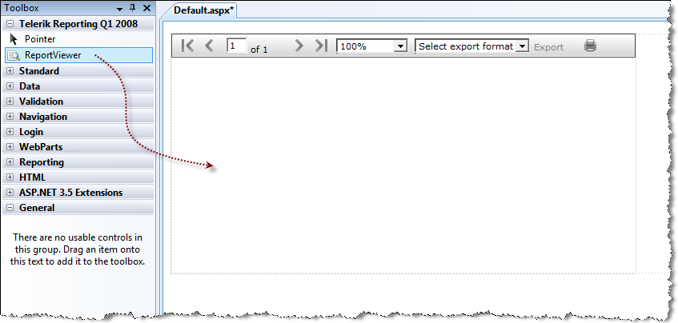

# How to Add report viewer to a web page


>note This is a legacy report viewer and for new projects our recommendation is to use the latest web forms report viewer -           [HTML5 Web Forms Report Viewer]()


## Assign report to the viewer in design time

To use Telerik Reports in web application, you need the Web report viewer:

1. Drag the __ReportViewer__  control from the __Toolbox__  to the design surface of a web form.  

  By doing so, the ReportViewer control would register automatically the http handler it needs to function               properly in the web.config file of the web application/site.             

   >note The http handler is automatically registered in the web.config only when the report viewer control is dropped from                 the Toolbox to the design surface of a web form. If you drop the report viewer in the text editor (source view) or add it to the web                 form programatically, you should manually register the http handler using the xml markup below, where x.x.x.x is your Telerik Reporting assembly version.
>In the __```<system.web>```\```<httpHandlers>```__  section:             

	
      ````XML
<system.web>
....
	<httpHandlers>
	      <add path="Telerik.ReportViewer.axd" verb="*" type="Telerik.ReportViewer.WebForms.HttpHandler, Telerik.ReportViewer.WebForms, Version=x.x.x.x, Culture=neutral, PublicKeyToken=a9d7983dfcc261be"/>
	</httpHandlers>
....
</system.web>
````

In the __```<system.webServer>```\```<handlers>```__  section:               

	
    ````XML
 <system.webServer> 		<handlers> 			<add name="Telerik.ReportViewer.axd_*" path="Telerik.ReportViewer.axd" verb="*" type="Telerik.ReportViewer.WebForms.HttpHandler, Telerik.ReportViewer.WebForms, Version=x.x.x.x, Culture=neutral, PublicKeyToken=a9d7983dfcc261be" preCondition="integratedMode"/> 		</handlers> 		<validation validateIntegratedModeConfiguration="false"/> </system.webServer>
````


1. Add reference to the class library that contains your reports in the web application/site.

1. Build the application

1. Set the __ReportSource__  for the report viewer. For more information, see[How to Set ReportSource for Report Viewers]()

## Assign report to the viewer programatically

In the __Page_Load__  event handler you create an instance report source and set its           __ReportDocument__  property to a report instance. Next assign the instance report source           to the __ReportSource__  property of the viewer.         

{{source=CodeSnippets\CS\API\Telerik\ReportViewer\WebForms\WebForm1.aspx.cs region=Webviewer_SetReportSource}}
````C#
	        protected void Page_Load(object sender, EventArgs e)
	        {
	            if (!IsPostBack)
	            {
	                var typeReportSource = new Telerik.Reporting.TypeReportSource();
	                typeReportSource.TypeName = "Telerik.Reporting.Examples.CSharp.ListBoundReport, CSharp.ReportLibrary";
	                this.ReportViewer1.ReportSource = typeReportSource;
	            }
	        }
````
{{source=CodeSnippets\VB\API\Telerik\ReportViewer\WebForms\WebForm1.aspx.vb region=Webviewer_SetReportSource}}
````VB
	    Protected Sub Page_Load(ByVal sender As Object, ByVal e As System.EventArgs) Handles Me.Load
	        If Not IsPostBack Then
	            Dim typeReportSource As New Telerik.Reporting.TypeReportSource()
	            typeReportSource.TypeName = "ListBoundReport, VB.ReportLibrary"
	            ReportViewer1.ReportSource = typeReportSource
	            ReportViewer1.RefreshReport()
	        End If
	    End Sub
````


# See Also


 * [Report Sources]()[](66CD7D60-7708-42D5-8BB4-506676E8679E)

 * [ASP.NET Web Forms Report Viewer]()

 * [Report Viewer Localization]()

 * [Deploying Web ReportViewer in SharePoint]()

 * [Medium Trust Support]()
