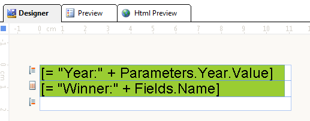

# How to Using Report Parameters to Retrieve Specific data


> This is a legacy report viewer and for new projects our recommendation is to use the latest web forms report viewer -           [HTML5 Web Forms Report Viewer]()

The goal is to retrieve a name depending on the selected year from a drop down list:  

  

1. A method with a parameter to retrieve the relevant data only is used as report data source.

    
      ````C#
static DataTable GetData(string year)
{
    DataTable table = new DataTable();
    table.Columns.Add("Name", typeof(string));
    if ("2007" == year)
    {
        table.Rows.Add("Peter");
    }
    else if ("2008" == year)
    {
        table.Rows.Add("Scott");
    }
    return table;
}
````
````VB.NET
Private Shared Function GetData(ByVal year) As DataTable
    Dim table As DataTable
    table = New DataTable()
    table.Columns.Add("Name", GetType(String))
    If (year = "2007") Then
        table.Rows.Add("Peter")
    ElseIf (year = "2008") Then
        table.Rows.Add("Scott")
    End If
    Return table
End Function
````

1. Creating the report parameter:  

  

1. Setting Value for the TextBox items:  

  

1. Setting the report __DataSource__  to the GetData method in the __NeedDataSource__  event handler of the report:

    
      ````C#
private void Report2_NeedDataSource(object sender, EventArgs e)
{
    Telerik.Reporting.Processing.Report report = (Telerik.Reporting.Processing.Report)sender;
    report.DataSource = GetData(report.Parameters["Year"].Value.ToString());
}
````
````VB.NET
Private Sub Report2_NeedDataSource(ByVal sender As System.Object, ByVal e As System.EventArgs) Handles MyBase.NeedDataSource
    Dim report As Telerik.Reporting.Processing.Report = DirectCast(sender, Telerik.Reporting.Processing.Report)
    report.DataSource = GetData(report.Parameters("Year").Value.ToString())
End Sub
````

1. Attach the __SelectedIndexChanged__  event handler of the __DropDownList__. In the event handler, get the report assigned to the viewer                    (in the example the ReportSource is __InstanceReportSource__ )                 and set the value of the report parameter to the selected item of the __DropDownList__ :

    
      ````C#
protected void DropDownList1_SelectedIndexChanged(object sender, EventArgs e)
{
     InstanceReportSource reportsource = (InstanceReportSource)this.ReportViewer1.ReportSource;
     Report report = (Report)reportsource.ReportDocument;
     report.ReportParameters["Year"].Value = ((DropDownList)sender).SelectedItem.Value;
     ReportViewer1.RefreshReport();
}
````
````VB.NET
Protected Sub DropDownList1_SelectedIndexChanged(ByVal sender As Object, ByVal e As System.EventArgs) Handles DropDownList1.SelectedIndexChanged
     Dim reportsource As InstanceReportSource = DirectCast(Me.ReportViewer1.ReportSource, InstanceReportSource)
     Dim report As Report = DirectCast(reportsource.ReportDocument, Report)
     report.ReportParameters("Year").Value = DirectCast(sender, DropDownList).SelectedItem.Value
     ReportViewer1.RefreshReport()
End Sub
````


