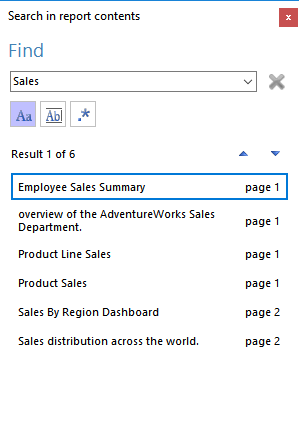

# Search in Report Contents

WinForms Report Viewer provides the capability to search in report contents. Since the viewer renders the report as image, the search process uses metadata, gathered during the report processing. The metadata entries are added per each textual report item and contain text contents and physical bounds, which determine the highlighted areas of the currently found and selected search items. The metadata text contents are used by the search dialog to perform the actual search. 

## Controlling Search Behavior

The behavior of the search dialog depends on the [SearchMetadataOnDemand](/reporting/api/Telerik.ReportViewer.WinForms#Telerik_ReportViewer_WinForms_SearchMetadataOnDemand) property. Its default value is __false__, which means that by default the processing engine will include search metadata in the rendering result of every report processing. As a result, the search dialog will be able to perform a search in report contents immediately. This metadata is stored in the memory, so for a very huge reports it could cause a performance drawback. 

If the [SearchMetadataOnDemand](/reporting/api/Telerik.ReportViewer.WinForms#Telerik_ReportViewer_WinForms_SearchMetadataOnDemand) property is set to __true__, the processing engine will not include the search metadata in the rendering result set. This metadata will be fetched "on demand", which will occur when the search dialog is shown. In this case the currently loaded in the viewer report will be processed once again to obtain the metadata and pass it to the search dialog. 

## Search dialog  

  

The search dialog is a standalone WinForms form, toggled either from the report viewer toolbar or with the __Ctrl+F__ key combination. The dialog stays on top of the report viewer, but since it's not modal, the viewer remains fully functional even when the search dialog is shown. Initially the dialog shows in the top-right corner of the report viewer area, but if there is no available space, it will be placed in the top-right corner of the virtual desktop. The dialog persists its position when closed and opens on the same place next time it is opened until the viewer is active. The dialog can be closed with the red close button in the top-right corner, or with ESC key. 

The dialog consists of the following components: 

* __Search combobox__ - used to enter the search token. The search process is triggered on every keystroke, but its actual start is delayed by one second after the last keystroke. 

* __Stop button__ - stops currently running search. The button is enabled only when a search is already started and disables when the search is completed. 

* __Match case button__ - this toggle button sets a search criteria that requires to match the casing of the search token and provided metadata. 

* __Match whole word__ - this toggle button sets a criteria that searches the metadata for a whole word, equal to the provided search token. 

* __Use regular expressions__ - this toggle button allows to perform a search using the regular expression rules in search combobox. In case the entered regular expression is incorrect, a warning red icon next to the button will appear and the exception message will be set as its tooltip. 

* __Results list__ - a data grid control used to display the found results and navigate through them. The grid will show the first 1000 results in order to optimize performance and enable dialog responsiveness. Although the amount of shown results is limited, the label above will display the actual count of found results. Every match of the metadata entries against the token is displayed on a separate row. If the token is found more than once in a metadata entry, every match will be shown as a new row. The data grid row shows a small excerpt from the metadata text and the page on which the result is found. 

* __Navigation buttons__ - these buttons are used to change the currently selected row. The selection can also be changed with the arrow keys. 

The dialog relies on search metadata, which is obtained from every rendering result. Along with the textual content and physical bounds of a textual item, every metadata entry contains also the page number where the item is positioned. Even consecutive renderings of a same report could produce a different number of pages, so when the user navigates to another report, refreshes the current report or changes the report viewer's view mode, the search dialog closes and needs to be opened again. 

## Important Notes

The complex data items like Graph and Map provide metadata for each data point label, axis label, title and legend, but since these complex items are rendered as a consistent image, they will be entirely highlighted even when the search token matches any of their composite parts. 
