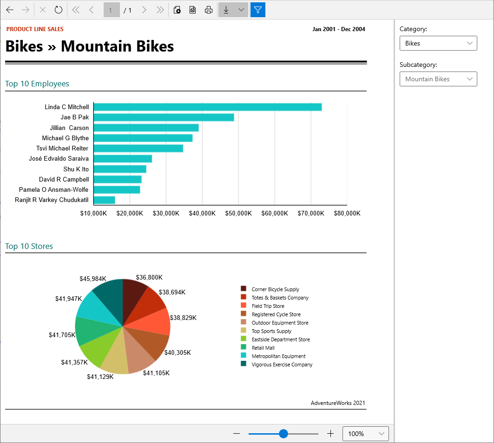

# WinUI 3 Desktop Application Overview

The WinUI report viewer allows developers to deliver reports produced by Telerik Reporting to any application developed using WinUI 3 desktop framework.         

  

## 

The toolbar of the WPF report viewer provides basic functionality for interacting           with the currently loaded report:         

* Navigate back in history

* Navigate forward in history

* Stop rendering

* Refresh

* Go to first page

* Go to previous page

* Go to a specific page

* Total number of pages

* Go to next page

* Go to last page

* Page settings

* Print Preview: switches between __Logical__  and __Physical__  page renderer. See [Rendering and Paging]() for more info.             

* Print

* Export: see [Export Formats]() for available export formats.             

* Show/Hide document map (where applicable)

* Show/Hide parameters area (where applicable)

The bottom panel of the WinUI report viewer contains a slider and drop-down list that control the current zoom level applied on the loaded report contents.         

## 

In order to use the WinUI report viewer, you need a WinUI 3 desktop application. In order to create such, you need the following tools installed:         

* Visual Studio 2019 or Visual Studio 2022 with enabled Universal Windows Platform development.

* Windows 10 SDK 10.0.18362 or later installed.

Visual Studio 2019 and Visual Studio 2019 Preview have known issues when building WinUI applications targeting .NET 5, while having .NET 6 SDK installed on the machine.           For a smooth development experience we recommend using Visual Studio 2022 and .NET 6 SDK Preview 6 or later. Otherwise you might need to deinstall .NET 6 SDK in order to build WinUI 3 applications.         

## How it works

The WinUI ReportViewer control is a composite of Telerik UI for WinUI desktop controls.           The viewer's functionality resides in Telerik.ReportViewer.WinUI.dll and the viewer's UI in Telerik.ReportViewer.WinUI.Themes.dll.         

The purpose of the WinUI ReportViewer control is to display Telerik Reports and allow the user to interact with them.           Reports are processed and rendered on the client machine. The report in the viewer is rendered as standard XAML elements,           as Canvas and TextBlock, through Telerik Reporting XAML rendering mechanism, adjusted for WinUI specifics.         

Due to the XAML-based nature of WinUI, the WinUI report viewer reuses parts of the source code written for the WPF report viewer, allowing better maintainability and ensuring error-proof development.           This is the reason why specific classes used by the WinUI report viewer might have Telerik.ReportViewer.Wpf namespace.         

## Known Limitations

Currently the WinUI Report Viewer does not provide the following functionalities:         

* Search in report contents.

* Enabled accessibility features for the report viewer and rendered report.

* Localization of the report viewer.

* Modifying the report viewer template through a dedicated .xaml file.             

The missing functionalities will be gradually added when possible, given that the current state of the WinUI 3 platform development allows it.

# See Also

# See Also

 * [Windows UI Library (WinUI)](https://docs.microsoft.com/en-us/windows/apps/winui/)

 * [Install tools for Windows app development](https://docs.microsoft.com/en-us/windows/apps/windows-app-sdk/set-up-your-development-environment#required-workloads-and-components)
