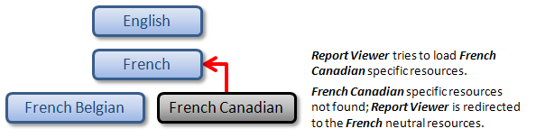

# Report Viewer Localization


In the WPF Report Viewer, localized resources are stored in separate __RESX__  resource files and loaded according to the current UI culture settings. To understand how localized resources are loaded, it is useful to think of them as being organized in a hierarchical manner.       

## Types of Resources in the Hierarchy

* At the top of the hierarchy sit the fallback resources for the default UI culture, which is English ("en") by default. These are the only resources that do not have their own file. They are stored directly in the assembly of the __Report Viewer__  .

* Below the fallback resources are the resources for any neutral cultures. A neutral culture is associated with a language but not a region. For example, French ("fr") is a neutral culture. Note that the fallback resources are also for a neutral culture, but a special one.

* Below those are the resources for any specific cultures. A specific culture is associated with a language and a region. For example, French Canadian ("fr-CA") is a specific culture.

When the __Report Viewer__  tries to load any localized resource and does not find it it will travel up the hierarchy until it finds a resource file containing the requested resource.         

The best way to store your resources is to generalize them as much as possible. That means to store localized strings in resource files for neutral cultures rather than specific cultures whenever possible. For instance, if you have resources for the French Belgian ("fr-BE") culture and the resources immediately above are the fallback resources in English, a problem may result when someone uses your application on a system configured for the French Canadian culture. The __Report Viewer__  will look for a __RESX__  file named "fr-CA", it will not find it and will load the fallback resource, which is English, instead of loading the French resources. The following picture shows this undesirable scenario.         

  

  

If you follow the recommended practice of placing as many resources as possible in a neutral resource file for the "fr" culture, the French Canadian user would not see resources marked for the "fr-BE" culture, but he or she would still see strings in French. The following situation demonstrates this preferred scenario.

  

  

## Naming Conventions for the Localization Resources

__The Report Viewer__  uses the following naming convention when searching for localized __RESX__  resource files in the main application folder:         

* The names of the __RESX__  localization resource files should have the following format:             *Telerik.ReportViewer.WPF.TextResources.[culture].resx* Here “__[culture]__ ” is the name of the culture for the specified localization resource. For example, to provide a localization resource               for the French Belgian culture, the corresponding resource file should be named as follows:             *Telerik.ReportViewer.WPF.TextResources.fr-BE.resx* 

* Respectively, to provide a localization resource for the French neutral culture, the corresponding resource file should               be named as follows:             *Telerik.ReportViewer.WPF.TextResources.fr.resx* 

* It is possible to override the default resources for the language neutral culture, which are stored in the assembly of the               __Report Viewer__ . In that case the resource file should be named as follows:             *Telerik.ReportViewer.WPF.TextResources.resx* 

As described above, if for example the current UI culture is set to French Belgian, the __Report Viewer__  will search for localized __RESX__  resource files inside the main application folder in the following order:         

1. Telerik.ReportViewer.WPF.TextResources. __fr-BE__  .resx

1. Telerik.ReportViewer.WPF.TextResources. __fr__  .resx

1. Telerik.ReportViewer.WPF.TextResources.resx

  

  

The above diagram illustrates a simple view of the resource fallback for a UI culture set to "fr-BE". The __Report Viewer__  handles the case probing the "fr-BE" __RESX__  resource file for the requested key first, and subsequently falls back to the neutral French culture "fr", ultimately looking in the default assembly resources for a value if a value has still not been found.         

## Adding Localization Resources for the Report Viewer

1. Add a new __RESX__  resource file to the main project of the application. Name the newly-created __RESX__  file according to the naming convention described above.

1. In the __Property Inspector__  specify the following properties for the resource file:

   1. __Build Action:__  "*None* "
              

   1. __Copy to Output Directory:__  "*Copy if newer* " or "*Copy always* "
              

1. Open the __RESX__  resource file in the __Visual Studio Resource Editor__  . Enter the required
            resource strings ([TextResources](/reporting/api/Telerik.ReportViewer.Wpf.TextResources))
            to translate the __Report Viewer__  to the desired language.

1. Repeat steps from 1 to 3 for each desired translation of the __Report Viewer__  .

1. Compile and run the project. When viewing a __Telerik Report__  , the __Report Viewer__  should be translated according to the current UI culture.

## Distributing an Application with a Localized Report Viewer

In order to distribute an application that uses __Telerik Reporting__            with a localized __Report Viewer__ , one should distribute all of the required           localization __RESX__  resource files, in addition to the main application assemblies.           For __WPF Applications__  the __RESX__            files should be placed in the same directory, where the application is installed.         

## Localization Using the ITextResources interface

The other way to localize the WPF __Report Viewer__  in a more flexible manner is to create a class that implements the           ITextResources interface and to implement all its properties, which represent all tooltips and messages in the Report Viewer. After you implement ITextResources you have to pass an instance of your custom class to the TextResources property ot the report viewer. The logic is pretty           simple, the property just has to return the correct translation for each resource key, as it is shown below:         

{{source=CodeSnippets\CS\API\Telerik\ReportViewer\Wpf\InterfaceLocalizationSnippets.cs region=InterfaceLocalizationSnippetStart}}
````C#
	        class CustomResources : Telerik.ReportViewer.Wpf.ITextResources
	        {
	            public string AllFiles
	            {
	                get
	                {
	                    return "Todos Archivos";
	                }
	            }
	            public string BackToolTip
	            {
	                get
	                {
	                    return "Navega hacia atrás";
	                }
	            }
	            public string CurrentPageToolTip
	            {
	                get
	                {
	                    return "Página corriente";
	                }
	            }
	
	            //...... Implement the rest of the properties ...... 
	        }
````
{{source=CodeSnippets\VB\API\Telerik\ReportViewer\Wpf\InterfaceLocalizationSnippets.vb region=InterfaceLocalizationSnippetStart}}
````VB.NET
	    Class CustomResources
	        Implements Telerik.ReportViewer.Wpf.ITextResources
	
	        Public ReadOnly Property AllFiles() As String Implements ReportViewer.Wpf.ITextResources.AllFiles
	            Get
	                Return "Todos Archivos"
	            End Get
	        End Property
	
	        Public ReadOnly Property BackToolTip() As String Implements ReportViewer.Wpf.ITextResources.BackToolTip
	            Get
	                Return "Navega hacia atrás"
	            End Get
	        End Property
	
	        Public ReadOnly Property CurrentPageToolTip() As String Implements ReportViewer.Wpf.ITextResources.CurrentPageToolTip
	            Get
	                Return "Página corriente"
	            End Get
	        End Property
	
	        '...... Implement the rest of the properties ......
	    End Class
````


Instead of a hard-coded string the property can be set in a method/contructor or to be created a method that returns string and implements a cutsom logic,           for example retreives the resource key from a database.         

{{source=CodeSnippets\CS\API\Telerik\ReportViewer\Wpf\InterfaceLocalizationSnippets.cs region=InterfaceLocalizationUsingMethodsSnippetStart}}
````C#
	        class CustomTextResources : Telerik.ReportViewer.Wpf.ITextResources
	        {
	
	            public string AllFiles
	            {
	                get
	                {
	                    return SqlHelper.GetViewerKeyFromDb(TextResourcesEnum.AllFiles);
	                }
	            }
	
	            public string BackToolTip
	            {
	                get
	                {
	                    return SqlHelper.GetViewerKeyFromDb(TextResourcesEnum.BackToolTip);
	                }
	            }
	
	            public string CurrentPageToolTip
	            {
	                get
	                {
	                    return SqlHelper.GetViewerKeyFromDb(TextResourcesEnum.CurrentPageToolTip);
	                }
	            }
	
	            //...... Implement the rest of the properties ......
	        }
````
{{source=CodeSnippets\VB\API\Telerik\ReportViewer\Wpf\InterfaceLocalizationSnippets.vb region=InterfaceLocalizationUsingMethodsSnippetStart}}
````VB.NET
	    Class CustomTextResources
	        Implements Telerik.ReportViewer.Wpf.ITextResources
	
	        Public ReadOnly Property AllFiles() As String Implements ReportViewer.Wpf.ITextResources.AllFiles
	            Get
	                Return SqlHelper.GetViewerKeyFromDb(TextResourcesEnum.AllFiles)
	            End Get
	        End Property
	
	        Public ReadOnly Property BackToolTip() As String Implements ReportViewer.Wpf.ITextResources.BackToolTip
	            Get
	                Return SqlHelper.GetViewerKeyFromDb(TextResourcesEnum.BackToolTip)
	            End Get
	        End Property
	
	        Public ReadOnly Property CurrentPageToolTip() As String Implements ReportViewer.Wpf.ITextResources.CurrentPageToolTip
	            Get
	                Return SqlHelper.GetViewerKeyFromDb(TextResourcesEnum.CurrentPageToolTip)
	            End Get
	        End Property
	
	        '...... Implement the rest of the properties ......
	    End Class
````


## Related articles

 [TextResources](/reporting/api/Telerik.ReportViewer.Wpf.TextResources) 

[WPF Application]()

[How to Add report viewer to a WPF .NET Framework project]()

[Setting a Theme (Using Implicit Styles)]()

# See Also


# See Also

 * [Hierarchical Organization of Resources for Localization](https://docs.microsoft.com/en-us/previous-versions/visualstudio/visual-studio-2013/756hydy4(v=vs.120))

 * [WPF Globalization and Localization Overview](http://msdn.microsoft.com/en-us/library/ms788718(v=VS.85).aspx)

 * [Create satellite assemblies for .NET apps](https://docs.microsoft.com/en-us/dotnet/core/extensions/create-satellite-assemblies)
