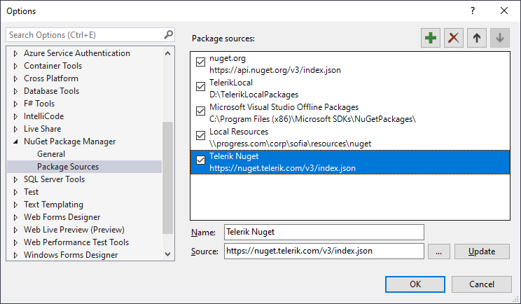
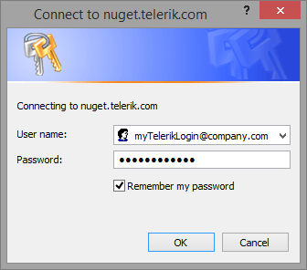

# How to add the Telerik private NuGet feed to Visual Studio


>note The legacy https://nuget.telerik.com/nuget server will be deprecated. Make sure to switch to the new            https://nuget.telerik.com/v3/index.json server, which is faster, lighter, and reduces the number of requests from your NuGet client.         


Telerik provides NuGet packages from private NuGet feed.          The article elaborates on how to add the Telerik NuGet feed to the Visual Studio NuGet package manager.        

## Prerequisites:

* Visual Studio 2010 or newer.

* Valid Telerik Reporting trial or paid license.

## 

###Setup

1. Open Visual Studio.             

1. Go to __Tools__  > __NuGet Package Manager__  > __Package Manager Settings__ , select __Package Manager Sources__  and then click the __+__  button.             

1. Choose feed __Name__ , set the feed __URL__  to: __https://nuget.telerik.com/v3/index.json__  and click __OK__ .             
>caption Figure 1: Visual Studio NuGet Package Manager and Telerik NuGet Feed:

  

  

1. Create or load your project.             

1. Go to __Tools__  > __NuGet Package Manager__  > __Manage NuGet Packages for solution__ .             

1. In the upper right-hand corner of the __Manage Packages for Solution__  window, select the Telerik __Package source__  that you just added.             

1. Choose the __Online / Browse__  list of packages (depending on your VS version).             

1. Enter your Telerik credentials in the Windows Authentication dialog (e.g., user: my.name@my.company.com and password: myPassPhraseForTelerikDotCom).             

1. Enter your credentials only once by selecting the __Remember my password__  checkbox.             
>caption Figure 2: Enter your Telerik.com credentials to access the Telerik NuGet feed:

  

  

1. Now all the packages that are licensed (paid or trial) to the above users are available in the Visual Studio NuGet Package manager.             

###            Setup with NuGet CLI
          

1. Download the latest                    [NuGet executable](https://dist.nuget.org/win-x86-commandline/latest/nuget.exe) .                 

1. Open a Command Prompt and change the path to the nuget.exe location.                 

1. The command from the example below stores a token in the                   %AppData%\NuGet\NuGet.config file. Your original credentials cannot be                    obtained from this token.                 

	
    ````powershell

NuGet Sources Add -Name "telerik.com" -Source "https://nuget.telerik.com/v3/index.json" ^
-UserName "your login email" -Password "your password"
````


    If you are unable to connect to the feed by using encrypted credentials,                    try the alternative approach of storing credentials in clear text.                 

	
    ````powershell

NuGet Sources Add -Name "telerik.com" -Source "https://nuget.telerik.com/v3/index.json" ^
-UserName "your login email" -Password "your password" ^
-StorePasswordInClearText
````


    If you have already stored a token instead of storing the credentials as clear text,                    you could update the definition in the %AppData%\NuGet\NuGet.config file using                    the following command:                 

	
    ````powershell

NuGet Sources Update -Name "telerik.com" -Source "https://nuget.telerik.com/v3/index.json" ^
-UserName "your login email" -Password "your password" ^
-StorePasswordInClearText
````


## Troubleshooting

### After changing my Telerik password, I get [Telerik Nuget] The V2 feed at '...' returned an unexpected status code '401 Logon failed.' error

After changing your Telerik password,               you need to reset your credentials in the NuGet.config file.               To do this, open a Command Prompt and run the command:             

	
````powershell

NuGet Sources Update -Name "telerik.com" -Source "https://nuget.telerik.com/v3/index.json" -UserName "your login email" -Password "your new password"
````


# See Also

