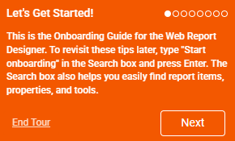
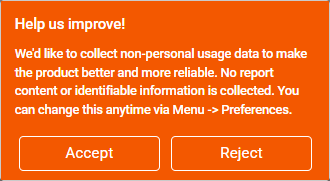

# App Tour of the Web Report Designer

Use the built-in app tour to get familiar with the Web Report Designer workspace before you start building reports. The tour introduces the main tools in the interface and shows where to find the areas you use most often while designing, previewing, and managing reports.

## Starting the App Tour

The onboarding tour starts automatically the first time you open an application that includes the Telerik Web Report Designer. Follow the prompts in the tour to move through the workspace and review the highlighted tools.

If your application owner has disabled the tour, or if you already dismissed it, you can reopen it later from the designer search box. The last section in this article shows how.

## Reviewing the Optional Usage Data Prompt

By default, the tour begins with the optional **Help us improve!** dialog:

>note
> The **Help us improve!** dialog asks whether you want to share non-personal usage data about the screens and tools used in the designer. This information helps improve the product experience, but the dialog is optional and you can continue working whether you accept or dismiss it.

## Watching the App Tour Video

<iframe width="560" height="315" src="https://www.youtube.com/embed/_igq459oDYg?si=SFvw6JMf2SvdRYbu" title="YouTube video player" frameborder="0" allow="accelerometer; autoplay; clipboard-write; encrypted-media; gyroscope; picture-in-picture; web-share" referrerpolicy="strict-origin-when-cross-origin" allowfullscreen></iframe>

Watch the video to see the onboarding flow and the main workspace areas before you try them in your own application.

## Exploring the Main Workspace Areas

The app tour highlights the main elements of the Web Report Designer interface:

* An interactive **Design surface** where you  create and style your report.
* A **Components tray** which contains all of the items that you can add to the report.
* An **Explorer** providing a tree-based structure of everything that is already in the report, including the data structure.
* A **Properties area** which shows the properties and values for the currently selected component.
* A **Main menu** which lets you open, save, and interact with reports on a global level along with the **Asset Manager** which is where you store all of your assets.
* A **Preview** button which shows an exact representation of the designed report.
* A **Search box** which allows you to search the report instance for any properties, component data sources, and so on. The Search box also allows you to locate tools, such as components that you can add to the report.

## Reopening the App Tour

To view the app tour again:

1. Open the Web Report Designer.
1. Click the **Search box**.
1. Type `Start onboarding`.
1. Select the onboarding command from the search results.

Use the reopened tour when you want to revisit the workspace layout, confirm what a tool does, or introduce another user to the designer.

## See Also

* [Create your first report in the Web Report Designer](slug:web-report-designer-user-guide-getting-started)
* [Explore report structure in the Web Report Designer](slug:user-guide/report-structure)
* [Web Report Designer documentation for developers](slug:telerikreporting/designing-reports/report-designer-tools/web-report-designer/overview)
