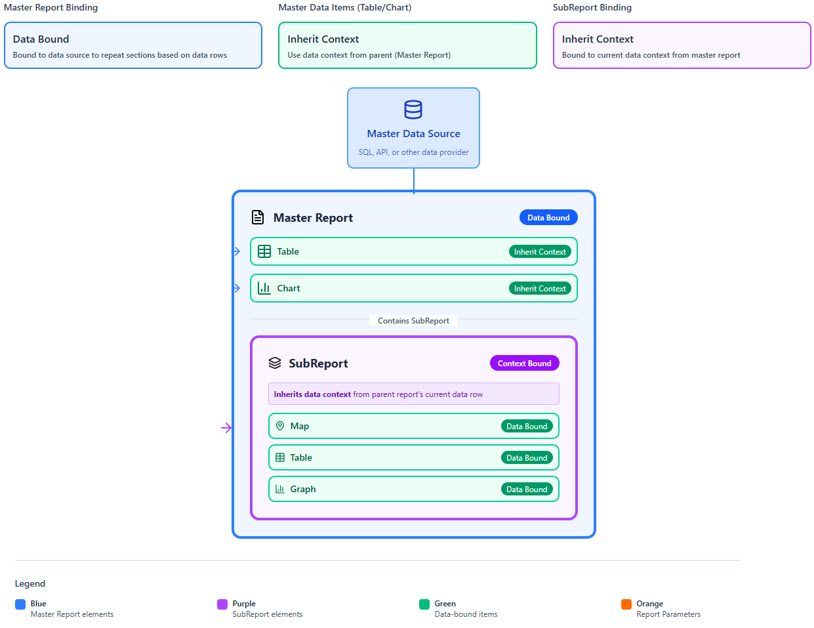
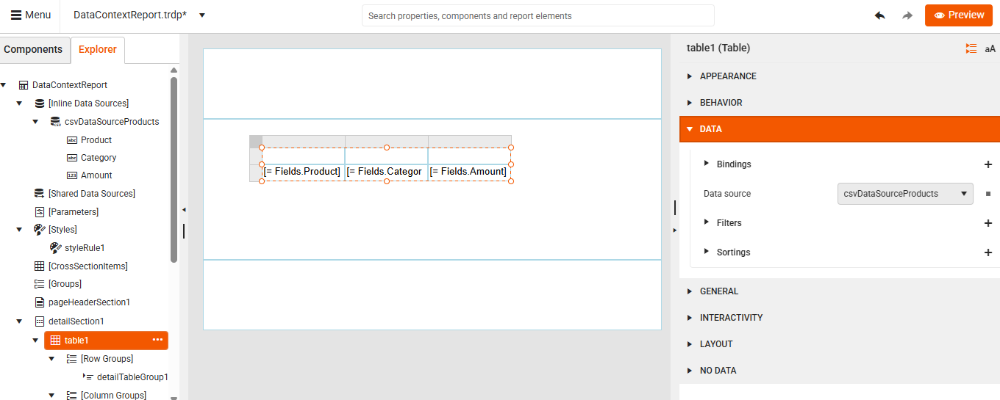
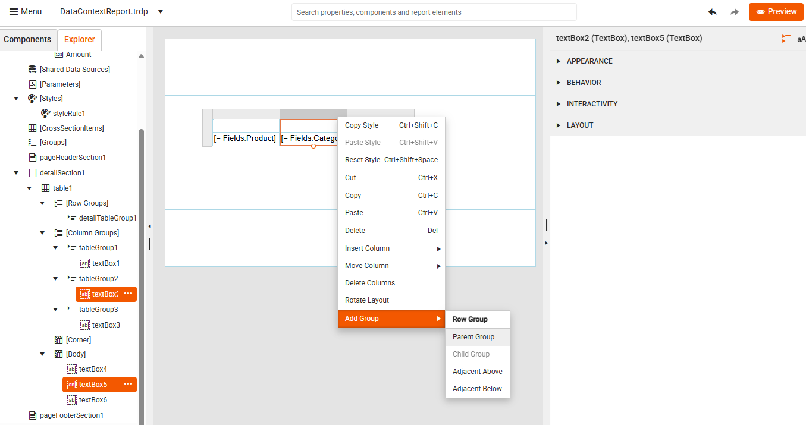
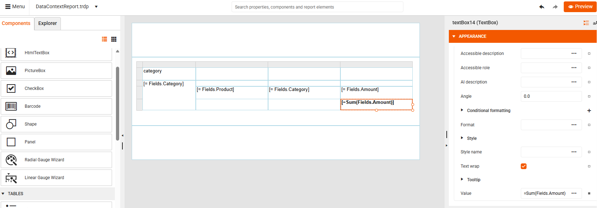
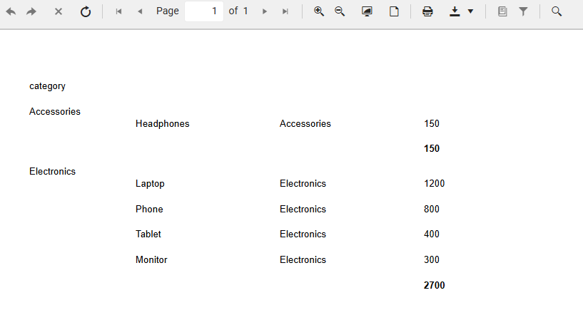

# Data Context

When you design a report in the Telerik Web Report Designer, every item (such as a table, chart, text box, or list) works within a **data context**. Data Context (often called data scope) refers to the underlying data object that a report item is bound to while the report is being processed. That scope is determined by where the item lives in the report hierarchy (report level, group level, table/crosstab cells, etc.) and by the data item (Report, Table, Crosstab, Graph, Map) and its groups. 

##  Hierarchy of Data Scope

Think of a scope as data layers:

1. **Report scope**&mdash;The top-level report has its own DataSource and Parameters. The Report item (e.g., “Report1”) defines a top-level scope that includes all rows returned by its data source (after filtering/sorting). Everything inside the report but outside nested data items uses that scope by default. Expressions at this level can use: 
    * =Fields.* (if the report has a DataSource)
    * =Parameters.*
    * Aggregates (for exampple, =Sum(Fields.Amount))

1. **Data item scope** (for example, Table, List, Crosstab, Graph)&mdash;Each data item can define its own DataSource and groups (Row/Column groups). Inside the item, =Fields.* refers to the current row/group context of that item.

1. **Group scope**&mdash;Groups create nested (inner) scopes—Report groups, table/column/row groups, crosstab groups, and detail sections partition the data into smaller sets. Expressions inside a group are evaluated against just that group’s rows. The innermost “detail” is typically a single record. In group headers/footers and detail cells, =Fields.* resolves in the group’s context. Aggregates can target specific scopes by name: =Sum(Fields.Amount, "groupName").

1. **SubReport scope**&mdash;A SubReport does not implicitly inherit its parent’s data context.
You pass data into a SubReport using ParameterBindings. Inside the SubReport, =Fields.* only works if that SubReport report definition has its own DataSource. SubReports do not inherit parent context unless passed explicitly-Bind parameters on the SubReport’s ReportSource to the parent’s current data scope. A similar approach is demonstrated in [Creating Master-Detail Reports](). You can also use a DataObject as a data source for nested data items. Meaning the child item’s entire data source can derive from the parent. The most common scenario is when a parent data row contains a JSON column with child items. A similar approach is demonstrated in [Creating Nested Hierarchy with SubReports]()

>note **Default scope**—If you don’t specify a scope in an expression, the Reporting engine looks up the nearest ancestor that defines a data scope and evaluates the expression there.

## Data Scope in Expressions

* **Field access** and **simple expressions** (like =Fields.Amount) run in the default scope, so inside a detail row it refers to the current record; inside a group footer it refers to the current group instance.

* **Aggregates** (like =Sum(Fields.Amount)) aggregate over the current scope unless you explicitly point them elsewhere. That is why =Sum(Fields.Amount) in a group footer returns the group subtotal, while the same in the report footer returns the grand total.

## Inheriting Data Context

The Data Context is inherited between report items. Items inside larger items inherit the data of their parent automatically. This means you often don’t have to manually connect each item to a database. The designer passes data downward for you. Every report starts with a top‑level data source. When the report runs, this data becomes the parent data context.
If you add items inside other items (for example, a table inside a report section), each nested item automatically receives the data of its parent. This behavior is defined as the ability to reuse the data from the parent, instead of creating a new data source.

 

>note Data context does not flow “sideways”&mdash;Items next to each other (e.g., two sibling panels) do not share context unless they share the same parent data item.</br>

## Own Data Context

 

### Example of Data Scope Inheritance

This tutorial builds a sample report to demonstrate scope inheritance. 

You will need a working data source (SQL, CSV, etc.) with at least:
* a numeric field (e.g., Amount)
* a grouping field (e.g., Category)

We will use a CSVDataSource in this tutorial with the following records: 

````CSV
Product,Category,Amount
Laptop,Electronics,1200
Phone,Electronics,800
Tablet,Electronics,400
Headphones,Accessories,150
Monitor,Electronics,300
````

1. Create a new report in the Web Report Designer.

1. Add a CSV Data Source to the report with the above data. Now your report has a `Report-level` data scope, containing all rows returned. It defines the outermost scope.

1. Add a Table: From the Toolbox drag a Table onto the design surface and bind it to your data source. A Table is a data item, so it switches scope to its own data source (`Data item-level` scope). Everything inside its detail section is evaluated per row.

1. Add fields to columns: 
    * Column 1: =Fields.Product
    * Column 2: =Fields.Category
    * Column 3: =Fields.Amount

    At this point Fields.Amount in detail row = value from the current record and Default scope = Table row (inner-most detail scope).

      

1. Preview the report.

     

1. Add a Row Group by **Category** using the [Table Context Menu]()

      
     

1. Save the group. This creates a new `Group-level` scope (subset of rows that share Category). Here, default scope = current group instance, so all fields refer to that group’s first record unless aggregated.

      

1. Preview the report. You will see the products grouped by category:

       

1. Add a Group Subtotal: In the Group Footer, select the TextBox under the **Amount** column and set the Value to `=Sum(Fields.Amount)`:

      

    Sum() automatically aggregates over the group scope, not the entire dataset. This is because the nearest ancestor defining a data scope is the group. For **Accessories** we have *Subtotal Amount = 150* and for **Electronics** the *SubTotal Amount = 2700*:

       

1. Add a Group Grand Total: In the Table Group, select the TextBox above the **Amount** column and set the Value again to `=Sum(Fields.Amount)`. This is the same expression as the one set in the group's footer. However, the result will be different due to the bigger data scope.

      
       

## See Also

* [Using ReportItem.DataObject]() 
