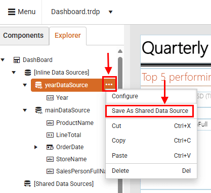
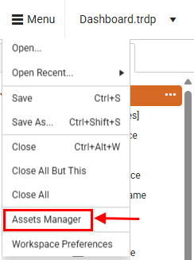

# Sharing and Reusing a Data Source

Instead of configuring a data connection every time you build a report, the Shared [Data Source]() component lets you set it up once and reuse it across multiple reports. This saves you time, reduces errors, and keeps your data connections consistent. Whether you're pulling data from a database, a file, or a web service, this approach helps you stay organized and efficient.

Here are the key benefits of using Shared Data Sources in Telerik's Web Report Designer:

* Reusability—Shared Data Sources enable you to define a data connection once and use it in many reports. This ensures consistency and simplifies maintenance—update the data source in one location, and all dependent reports automatically pick up the change.

* Separation of Roles & Collaboration—A data professional can define and maintain Shared Data Sources, while a report designer can focus on the visual layout and content—without needing to manage connection details.

* Security Layer & Hiding Connection Details—Shared Data Sources store sensitive information (like connection strings) on the server, preventing users from seeing them in the report definition. This enhances security and credential management.

* Centralized Access via Asset Manager—Shared Data Sources appear as assets in the Web Report Designer's Explorer (via the [Asset Manager](). This makes them discoverable to all report authors that are granted permissions.

You can easily connect your reports to a variety of data sources — giving you flexibility to work with the formats you already use, such as:

  * [SqlDataSource](#sql-data-source)
  * [WebServiceDataSource](#web-service-data-source)
  * [ObjectDataSource](#object-data-source)
  * [JsonDataSource](#json-data-source)
  * [CsvDataSource](#csv-data-source)

## Configuring a Shared Data Source

To create a shared data source:

1. In the Web Report Designer, open an existing report that already has a data source.
1. Go to the **Explorer** tab, click the ellipsis button (**...**) next to the data source, and then select **Save as Shared Data Source** from the context menu.

   

After saving a data source as shared, the Web Report Designer generates an `.sdsx` file. This file represents the shared data source definition that you can open directly in the designer for further configuration.

   

To view all existing Shared Data Sources, open the [Assets Manager]() from the main menu.

   

The next video demonstrates how to create a Shared Data Source from an existing report.

<iframe width="560" height="315" src="https://www.youtube.com/embed/Yaeql2tl3tA?si=EaOahE2CMqzPQi8t" title="YouTube video player" frameborder="0" allow="accelerometer; autoplay; clipboard-write; encrypted-media; gyroscope; picture-in-picture; web-share" referrerpolicy="strict-origin-when-cross-origin" allowfullscreen></iframe>

## Differences between Shared Data Source and Data Source

In the Web Report Designer, both Data Source and Shared Data Source are used to define connections to external data. However, they differ in scope, usage, and maintainability.

| Data Source | Shared Data Source |
| ------ | ------ |
| Defined within a single report | Defined outside of individual reports and stored as an `.sdsx` file |
| Cannot be reused across other reports | Can be reused across multiple reports |
| Changes to the data source affect only the report where it is defined | Changes to the shared data source affect all reports that reference it |
| Suitable for simple or one-off reports | Ideal for centralized data management and large-scale reporting solutions |

## See Also

* [Web Report Designer User Guide: An Overview]()
* [App Tour of the Web Report Designer]()
* [Create a Simple Report]()
