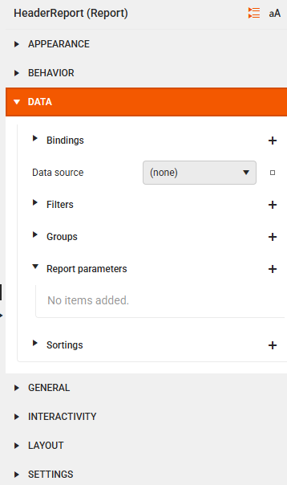
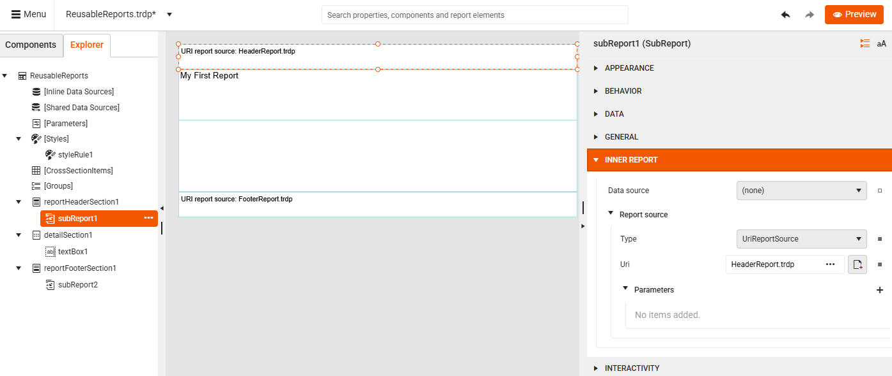
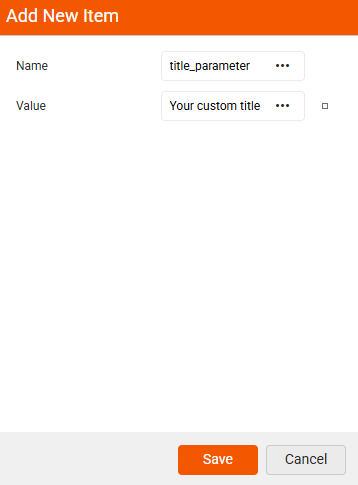
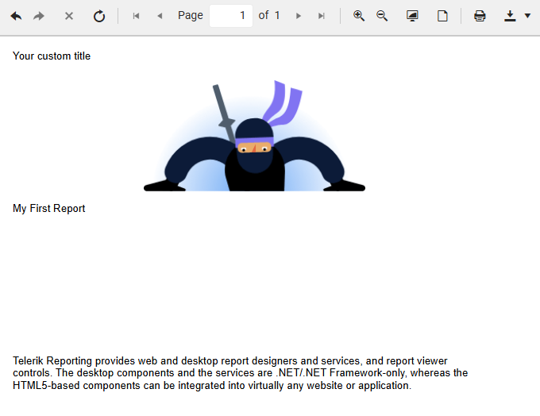

# Creating Reusable Report Headers and Footers with SubReport

The SubReport item is perfect for creating reusable report components that can be embedded in larger reports later. It can be useful for creating, for example, **report** or **group** headers and footers.

Here's a step-by-step tutorial for creating a reusable part of a report (for example, header and footer) using a SubReport:

<iframe width="560" height="315" src="https://www.youtube.com/embed/BEfNQsuqzME?si=hSHQuYQ1IPvTYopW" title="YouTube video player" frameborder="0" allow="accelerometer; autoplay; clipboard-write; encrypted-media; gyroscope; picture-in-picture; web-share" referrerpolicy="strict-origin-when-cross-origin" allowfullscreen></iframe>

## Creating the Header Report

1. Create a new report (for example, `HeaderReport.trdp`).

1. Remove the default **page** header and footer.

1. Add elements like company logos and report titles in the Detail section.

1. Preview and save this report as a standalone file. This will serve as your reusable header part of a bigger report.

## Creating the Footer Report

1. Create a new report (for example, `FooterReport.trdp`).

1. Remove the default **page** header and footer.

1. Add elements like information text or any other meaningful content to the Detail section of a report.

1. Preview and save this report as a standalone file. This will serve as your reusable footer part of a bigger report.

## Adding SubReports to Your Main Report

1. Create a new report that will serve as the main report.

1. Remove the default **page** header and **page** footer if not needed.

1. Add a **report** header and a **report** footer.

1. Select the Report Header section and add a SubReport item.

1. Navigate to the **INNER REPORT** section and select the **UriReportSource** option.

1. For the **Uri** field, select the `HeaderReport.trdp`.

1. Select the Report Footer section again and add another SubReport item.

1. Navigate to the **INNER REPORT** section and select the **UriReportSource** option.

1. For the **Uri** field, select the `FooterReport.trdp`.

1. Select the Details section and add a TextBox item with a sample text.

1. Preview the report which contains reusable header and footer subreports.

Thus, you can create separate reports that serve as standalone report parts and can be reused in multiple reports according to the specific requirements. 

## Passing Data to SubReports

Instead of using fixed data in the report headers/footers, it is possible to pass a title (or any text) from a main report to a TextBox in a SubReport, using the parameter‑passing mechanism. The above example can be further extended by replacing the "Telerik Reporting" text in the HeaderReport.trdp with a value coming from the main report. 

Here are the steps to pass a title from the main report to a TextBox in the SubReport:

1. Define a parameter in the SubReport

    1.1. Open the SubReport report (HeaderReport.trdp) in the Report Designer.

    1.2. Go to Report >> Data >> Report Parameters.

     

    1.3. Add a new parameter:

    * Name: "title_parameter"

    * Type: String

    * Allow null: Yes (optional)

     

2. Bind a TextBox in the SubReport to that parameter

    2.1. Select the TextBox inside the SubReport report where the title should appear.

    2.2. Set its Value to: 

    ```
    =Parameters.title_parameter.Value
    ```
    Now, the TextBox displays whatever the main report passes in.

3. Map the main report value to the SubReport parameter

    3.1. Open the main report and select the SubReport header item.

    3.2. Go to Inner Report and add a new parameter:

    * Name: "title_parameter"

    * Value: "Your custom title"

      


      

4. Preview the report with your custom title:

          


## See Also

* [Web Report Designer]()
* [Data Sources]()
* [Report Sections]()
