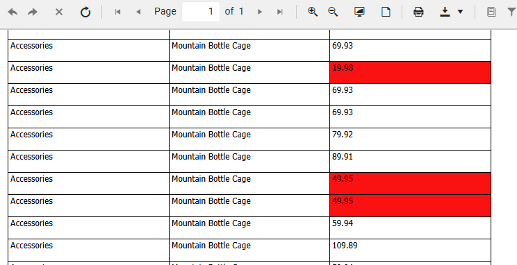

# Using Conditional Formatting 

To visually highlight important data, **Conditional formatting** lets you automatically style report items based on the values they display. This makes your reports more dynamic and easier to read. For example, you can set a TextBox showing revenue to turn red if the value drops below 10,000. This helps you draw attention to numbers that need review or action.
 
  

  
  
## Formatting a Single Item

To format a single cell value based on a specific condition, for example, **LineTotal &lt; 50**:

1. Populate a Table report item with data to format.

1. Select the desired TextBox item (for example, LineTotal).

1. Type "Conditional formatting" in the search box.

1. Add a new formatting rule with the desired expression (for example, "=Fields.LineTotal LessThan 50").

1. Apply the desired style settings for the added rule (for example, red background).

The quick video tutorial below shows how to apply conditional formatting to a LineTotal TextBox in a table by changing its color to red when a value is less than 50.

<iframe width="560" height="315" src="https://www.youtube.com/embed/85fy2jnM824?si=LjzAEceqot2RGwPI" title="YouTube video player" frameborder="0" allow="accelerometer; autoplay; clipboard-write; encrypted-media; gyroscope; picture-in-picture; web-share" referrerpolicy="strict-origin-when-cross-origin" allowfullscreen></iframe>

## Formatting Multiple Items 

If you want to apply the same rule to the entire row with data, it requires you to apply rules **individually** to each item one by one. However, to save time, you can group items inside a Panel and apply the conditional formatting to the panel itself. This way, the Panel (and everything inside it) will be styled based on your condition. This approach is shown in the following video: 

<iframe width="560" height="315" src="https://www.youtube.com/embed/JM1OOUEqU6s?si=RyRjGmd39YLANaEd" title="YouTube video player" frameborder="0" allow="accelerometer; autoplay; clipboard-write; encrypted-media; gyroscope; picture-in-picture; web-share" referrerpolicy="strict-origin-when-cross-origin" allowfullscreen></iframe>

## Alternating Row Style

To make it easier for users to distinguish between rows, especially in large tables or lists, applying alternating background colors (e.g., white and orange) improves readability. 

 

This is done by setting the following conditional formatting rule to one single item or all items within the row. 

|Expression|Operator| Value|
|----|----|----|
|= RowNumber()%2|Equal|1|
 
The following video shows how to achieve alternating row style which prevents misreading values by visually separating rows, which is critical for accuracy in data-heavy reports.

<iframe width="560" height="315" src="https://www.youtube.com/embed/aD_LtZDaX7o?si=5qJvKHTTiE3Z0Nb8" title="YouTube video player" frameborder="0" allow="accelerometer; autoplay; clipboard-write; encrypted-media; gyroscope; picture-in-picture; web-share" referrerpolicy="strict-origin-when-cross-origin" allowfullscreen></iframe>

## See Also

* [Web Report Designer]()
* [Styling the Report]()
