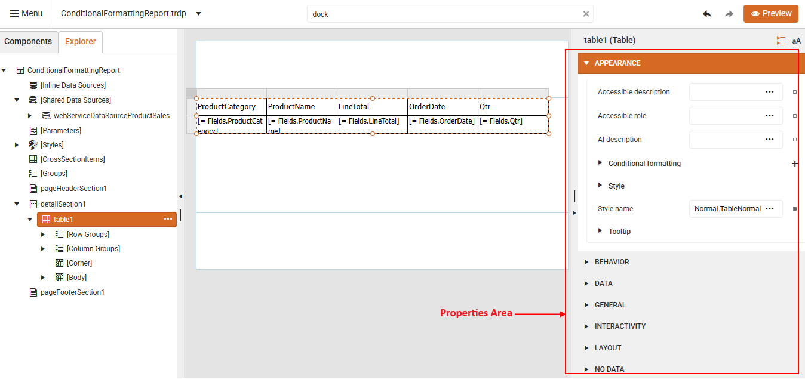
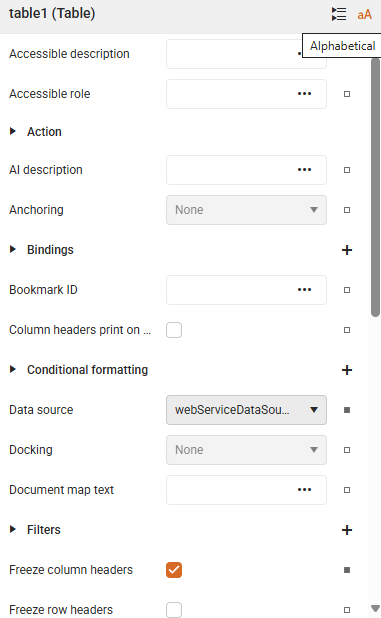

# Customizing Report Items: Overview

Customization of report items involves changing their properties to achieve both functional and aesthetic goals. These changes can be applied in two ways:

- Static customization: Properties are set once and remain unchanged throughout the report’s lifecycle.
- Dynamic customization: Properties adjust based on data or variables, such as the current date or logged-in user (see [Expressions]()).

The most important aspect of customization is styling. Styling report items ensures visual consistency (e.g., using themes or style rules), which improves readability, clarity, and brand alignment. Applying different colors, fonts, or layouts can distinguish sections and highlight key information, making reports more engaging and easier to interpret.

To customize or style report items in the Telerik Web Report Designer, you can use its

* [Conditional Formatting]() options
* Built-in CSS-like [styling model]()
* Properties Area.

## Properties Area

The **Properties Area** represents the section on the right-side where you can view and edit the properties of the currently selected report item. This area lets you control how each report item looks and behaves. Whether you are working with a TextBox, Table, Chart, or Image, this panel gives you access to all the relevant settings in one place:

* **Appearance**: Change fonts, colors, borders, background, padding, and more. Apply [conditional formatting](): dynamically change appearance based on data values.
* **Data**: Connect report items to fields or expressions from your data source.
* **Layout**: Modify size, position, alignment, and visibility.
* **Behavior**: Set actions like navigation, visibility rules, or interactivity.

   

### Key Features

To facilitate the easier styling of your report, the Properties Panel offers several features that simplify access to the built-in styling tools:

* **Different Views**: Choose the layout that fits your style:

  * **Categorized view**: Groups properties by function (like Appearance, Layout, Data), making it easier to find what you need.
  * **Alphabetical view**: Lists everything in alphabetical order&mdash;perfect when you know exactly what you're looking for.

|Categorized|Alphabetical|
|----|----|
| ||

* **Indent Guides**: When showing nested properties Indent Line Guides help you see how settings are structured, so you can navigate complex items with confidence: 

  

* **Search Box**: Use the Global Search bar at the top to instantly locate any property or editor. No more scrolling through long lists!

   

* **Reset Value**: If you have made a change you want to undo, note that each editable property has a `Reset button` next to it. Just click it to revert that setting to its default - without affecting anything else.

    

## See Also

* [Conditional Formatting]()
* [Stylesheet Formatting]()
