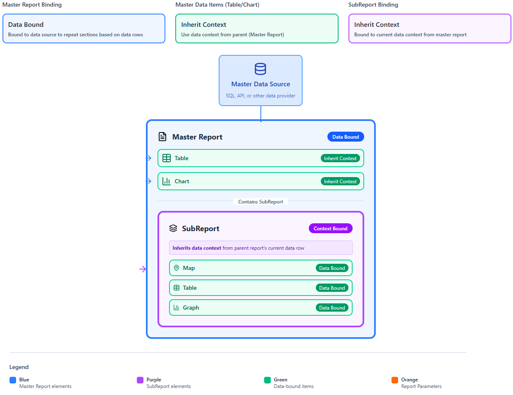
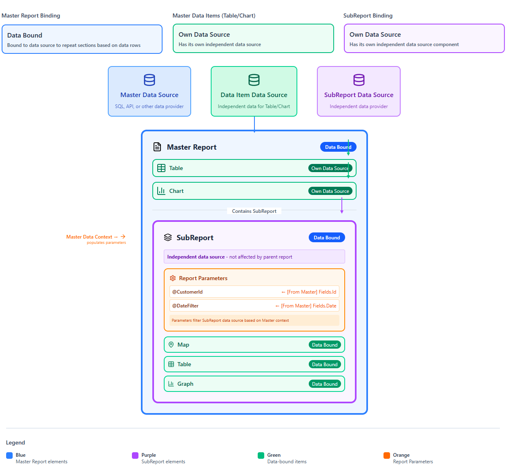

# Data Scope

When you build a report in the Telerik Web Report Designer, every item (like a table, chart, or text box) needs to know which data it can see and display. This is called **data scope** (also known as data context). What data an item can see and display is defined by the item's type and its place in the report hierarchy.

##  Data Scope Levels

Think of data scope like a set of nested containers—each one holds a smaller slice of data than the one around it, and each data scope sits on a different level:

* Report scope&mdash;The top-level report has its own data source and parameters. The report item (for example, “Report1”) defines the top-level data scope that includes all rows returned by its data source (after filtering and sorting). Everything inside the report, but outside nested data items, uses that scope by default. Expressions at this level can use: 
    * =Fields.* (if the report has a data source)
    * =Parameters.*
    * Aggregates (for example, `=Sum(Fields.Amount)`)

* Data item scope (for example, Table, List, Crosstab, Graph)&mdash;Each data item can define its own data source and groups (Row/Column groups). Inside the item, =Fields.* refers to the current row/group context of that item. Since Telerik Reporting uses hierarchical data scopes and each data item (Table, List, Group, etc.) creates its own scope, you can use the `Parent` keyword when you're inside a nested item and need access to values from an outer scope (for example,  =Parent.Fields.OrderID).

* Group scope&mdash;Groups create nested (inner) scopes—Report groups, table/column/row groups, crosstab groups, and detail sections partition the data into smaller sets. Expressions inside a group are evaluated only against that group’s rows. The innermost “detail” is typically a single record. In group headers/footers and detail cells, `=Fields.*` resolves in the group’s context. Aggregates can target specific scopes by name: `=Sum(Fields.Amount, "groupName")`.

* SubReport scope&mdash;A SubReport in Telerik Reporting does not inherit its data scope automatically from its parent report or parent data item. A SubReport always has its own data source, defined entirely by its ReportSource. This means that a SubReport is an isolated report that you load inside a parent report, and you control its data by passing parameters or by assigning it an explicit data source.
The Available Options for passing data to a SubReport are:

    * Own DataSource&mdash;When the SubReport refers to a separate report (.trdp file) that has its own data source and you pass parameters and let the SubReport query its own data. This is the most common method. A similar approach is demonstrated in [Creating Master-Detail Reports]() where the master report contains a table with Categories data. The SubReport displays Products records filtered by the respective CategoryID.

    * Pass Data from the Parent&mdash;You can also use a DataObject as a data source for nested data items. Meaning the child item’s entire data source can derive from the parent. The most common scenario is when a parent data row contains a JSON column with child items. A similar approach is demonstrated in [Creating Nested Hierarchy with SubReports]().

>note If you don’t specify a data scope in an expression, the **default data scope** is always the data scope of the closest enclosing data item or group.

## Data Scope in Expressions

The data scope directly affects how expressions behave. The same expression can produce different results depending on where it is placed in the report:

* **Field access** and **simple expressions** (like `=Fields.Amount`) run in the default scope, so inside a detail row it refers to the current record; inside a group footer it refers to the current group instance.

* **Aggregates** (like `=Sum(Fields.Amount)`) calculate over the current data scope by default. That is why the same `=Sum(Fields.Amount)` expression returns a group subtotal when placed in a group footer, but returns the grand total when placed in the report footer.

The Reporting engine provides the [Exec]() aggregate function to perform calculations outside the current data or item scope. Unlike typical aggregate functions such as Sum, Avg, or Count, which operate only on the current data scope, Exec allows you to reference another report item’s scope and retrieve its aggregated value.
This makes Exec extremely useful when you need to display aggregated values in headers, footers, textboxes, or other parts of the report where normal aggregates are not allowed.

````
=Exec("ReportItemName", AggregateExpression)
````

|Parameter|Description|
|----|----|
|"ReportItemName"|The name of the parent (one or more levels up the hierarchy) data item (e.g., a table, group, or list) that defines the scope.|
|AggregateExpression|A valid aggregate function (e.g., Sum(Fields.Price), Avg(Fields.Quantity)).|

The following example shows how to display Total Sales in a TextBox placed in the header:

````
=Exec("Report1", Sum(Fields.Price * Fields.Quantity))
````

* **Report1** defines the data scope.
* **Exec** evaluates the Sum expression as if it were inside the table.
* You get the correct total even though you are in the header.

## Data Scope Inheritance

By default, when a report item does not have its own data source, it automatically uses the data context of its parent. That's why you do not need to connect every item to a data source manually—the Web Report Designer passes data downward through the report's items and data scope levels for you.

Every report starts with a top-level data source. Items placed directly in the report use that data. Items nested inside other items (for example, a text box inside a table cell) inherit the data context of the item they are placed in. This lets you reuse the parent's data without creating a new data source for each child item.

 

>note The data scope is inherited only downward, not sideways. Two report items placed next to each other (siblings) do not share each other's data scope. Each item only inherits from its own parent.

## Independent Data Scope

When a data item has its own data source, it creates an independent data scope. Its children inherit that scope, not the parent report's data scope. This means the item's data is completely unaffected by the parent's filtering or grouping, making it easy to reuse tables, graphs, and SubReports across different parent reports.

Two common patterns for using an independent data context are:

* Master-Detail (Parent-Child)&mdash;A parent Table uses **DataSource A**. Inside the detail row, a child Table, List, or Graph sets its own **DataSource B**, filtered by a key from the parent row. To pass the parent row's value to the child data source, use `=ReportItem.DataObject.CustomerId` or `=Fields.CustomerId` as a data source parameter. The child item then shows only the rows that match the current parent row.

* SubReport&mdash;A SubReport is self-contained by design. You pass a parameter from the parent (for example, an `OrderId`) and the SubReport uses its own data source filtered by that parameter. This pattern is ideal when the same SubReport is reused across multiple parent reports.

>note See the [Creating Master-Detail Reports]() tutorial.

 

## See Also

* [Using ReportItem.DataObject]() 
* [Data scope related functions]()
* [Data Scope in Expressions]()
