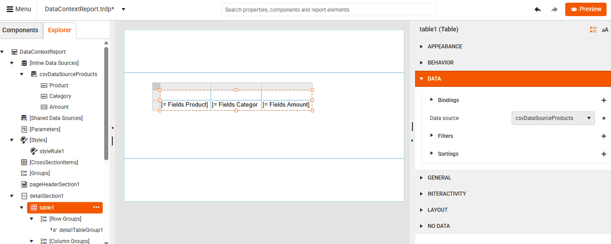
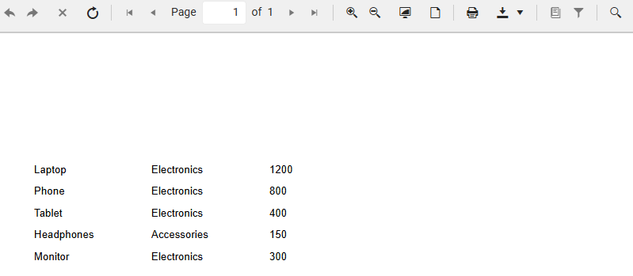
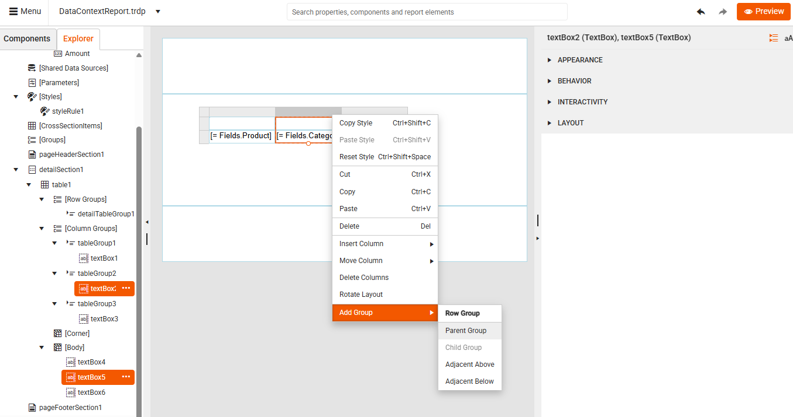
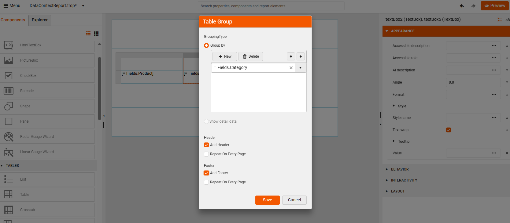
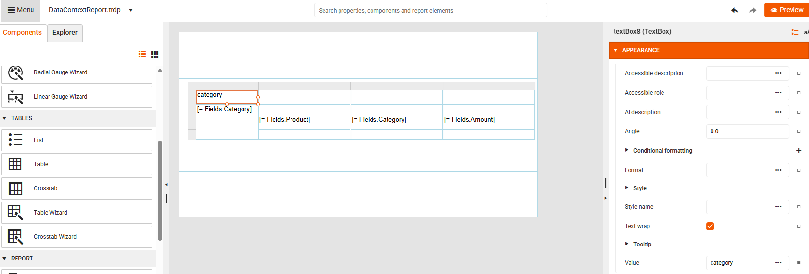
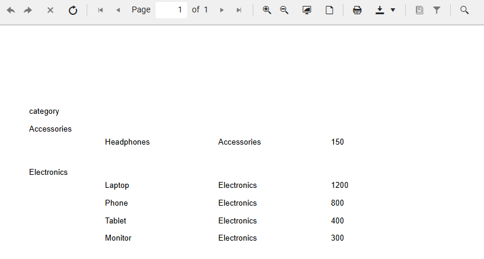
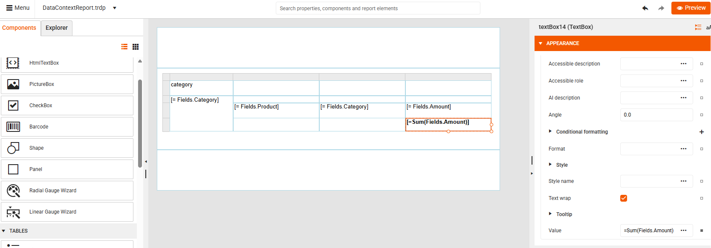
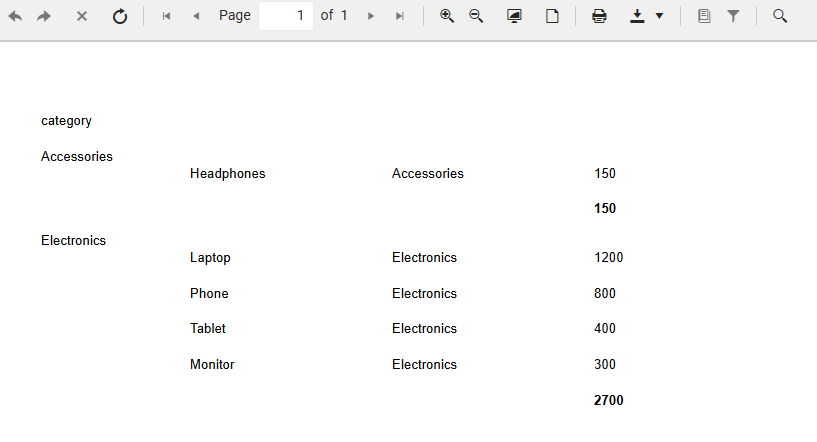
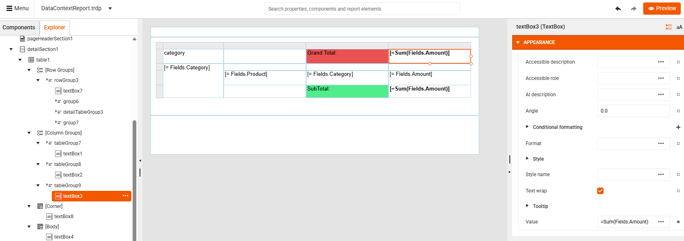

# Data Scope in Expressions

By following the steps below, you can build a sample report that will help you understand how the data scope inheritance works when using expressions.

1. Create a new report in the Web Report Designer.

1. Add a CSV Data Source to the report with the following data:

````CSV
Product,Category,Amount
Laptop,Electronics,1200
Phone,Electronics,800
Tablet,Electronics,400
Headphones,Accessories,150
Monitor,Electronics,300
````
If you explicitly set the DataSource property of  your report, it will define a report-level data scope, containing all rows. It would define the outermost scope. However, for this example, we will leave the Report.DataSource empty.

1. Add a Table: from the Components pane, drag a Table onto the design surface and bind it to your data source. A Table is a data item, so it switches scope to its own data source (data item-level scope). Everything inside its detail section is evaluated per row.

1. Add fields to columns: 
    * Column 1: 
        ````
        =Fields.Product
        ````

    * Column 2: 
        ````
        =Fields.Category
        ````

    * Column 3: 
        ````
        =Fields.Amount
        ````

    At this point Fields.Amount in detail row represents the value from the current record and the default scope is the Table row (inner-most detail scope).

      

1. Preview the report.

     

1. Add a Row Group by **Category** using the [Table Context Menu]().

      
     

1. Save the group. This creates a new group-level scope (subset of rows that share the same Category). Here, the default scope is the current group instance, so all fields refer to that group’s first record unless aggregated.

      

1. Preview the report. You will see the products grouped by category:

       

1. Add a Group Subtotal: In the Group Footer, select the TextBox under the **Amount** column and set the Value to `=Sum(Fields.Amount)`:

      

    `Sum()` automatically aggregates over the group scope, not the entire dataset. This is because the nearest ancestor defining a data scope is the group. For **Accessories**, *Subtotal Amount is 150* and for **Electronics**, the *SubTotal Amount is 2700*:

       

1. Add a Group Grand Total: In the Table Group, select the TextBox above the **Amount** column and set the Value again to `=Sum(Fields.Amount)`. This is the same expression as the one set in the group's footer. However, the result will be different due to the bigger data scope.

      
       

## See Also

* [Using ReportItem.DataObject]() 
* [Data scope related functions]()
