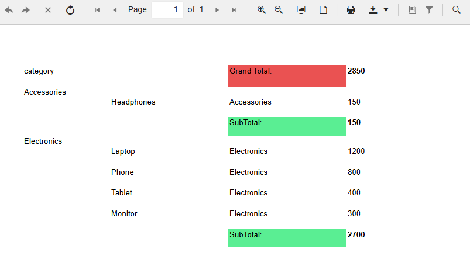
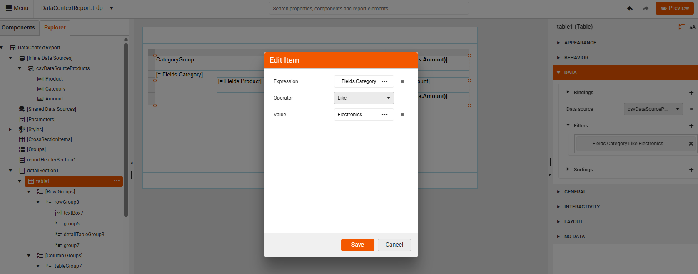
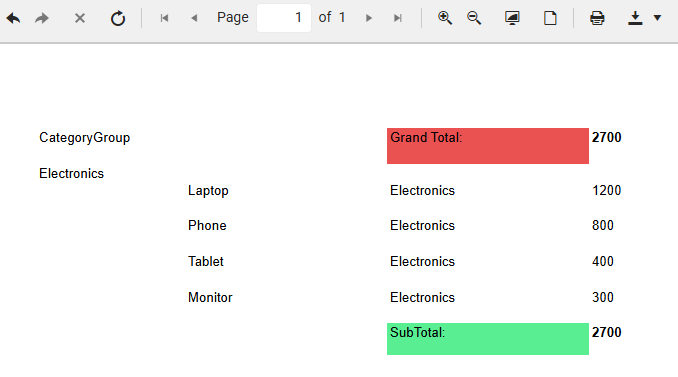
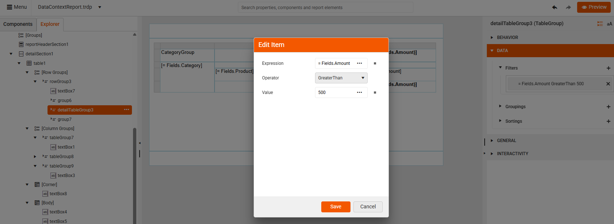
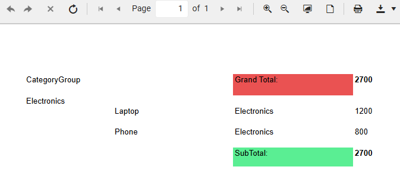
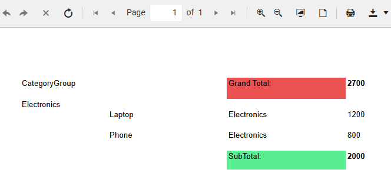

# Data Scope in Filters

You can filter data at multiple levels in your report. Each data level controls which records are available to the next level down. Parent scopes (like Tables) inherit all data unless you filter them. Child scopes (like Groups) inherit parent data (filtered or not) and can apply additional filters to the inherited data. 

This article is a continuation of the quick example demonstrated in [Data Scope in Expressions](). To continue reading, get familiar with the example first.

In the previous article we demonstrated how expressions in group-level scopes default to operating over the subset of records belonging to the group. Aggregates placed outside the group (like table header/footer) compute over all records that the Table receives.

That is why for the *Grand total we calculated 2850*, for **Accessories**, *Subtotal Amount is 150* and for **Electronics**, the *SubTotal Amount is 2700*.



Filters applied at a certain data level change the data scope. Whichever records remain after filtering form the current data scope. All aggregates (Sum, Avg, Count, etc.) operate only on that scope.

Report level filters affect all the data in the report, including all nested data items bound to the same source. Data item level filters affect only the data item (and its child items), not the whole report.

## Filtering the Table

We will filter the table to show only the products belonging to the "Electronics" category:

1. Select the table in the Explorer pane and add a filter: 

    ````
    Fields.Category = "Electronics"
    ````

     

1. Preview the report. You will see that both, the Grand Total (table data scope) and the SubTotal (groups data scope) values, are affected by the applied filter. Filters, applied to the parent data source, affect what records are available in the nested data items that inherit that data scope.

     


## Filtering the Group 

We will filter the groups now to show products with greater Amount than 500:

1. Select the detail table group in the Explorer pane and add a filter: 

    ````
    Fields.Amount >= 500
    ````

      

1. Preview the report. Now, you can see only products which amount is greater than 500. The Grand Total remains 2700 since it uses the table's data scope which is filtered by showing only Electronics. The SubTotal also remains 2700 because the Category group's scope still contains all Electronics rows (1200 + 800 + 400 + 300). Filtering the detail group level (Amount > 500)  does not change the data scope for group-level aggregates, so the subtotal in the group footer continues to include all records in the group, regardless of the detail filter. Group aggregates (such as Sum, Count, etc.) are evaluated over the group’s data records as defined by the group expression, not by the filtered detail rows. Filtering at the detail group level only affects which detail rows are displayed, but does not alter the underlying data set used for group-level calculations.

    >important It is possible to add a filter at the category group level, but a Category Group filter does NOT remove individual detail rows. It only determines if the entire category group should appear or not. Hence, if a group contains at least one record with *Amount greater than 500*, it will remain visible. 

      

    To achieve subtotals that reflect only the filtered records, you can adjust your report design to use a filtered data source for the group itself. An alternative approach is to use a conditional subtotal in the CategoryGroup footer which is demonstrated in the following step.

1. Apply a conditional sum to the group's footer&mdash;use an aggregate expression that sums only the values meeting your condition. The recommended approach is to use the Sum aggregate with an IIF (immediate if) statement:

    ````
    =Sum(IIf(Fields.Amount > 500, Fields.Amount, 0))
    ````

    Now, the SubTotal shows the expected value 2000: 

       
 

## See Also

* [Using ReportItem.DataObject]() 
* [Data scope related functions]()
* [Data Scope in Expressions]()
