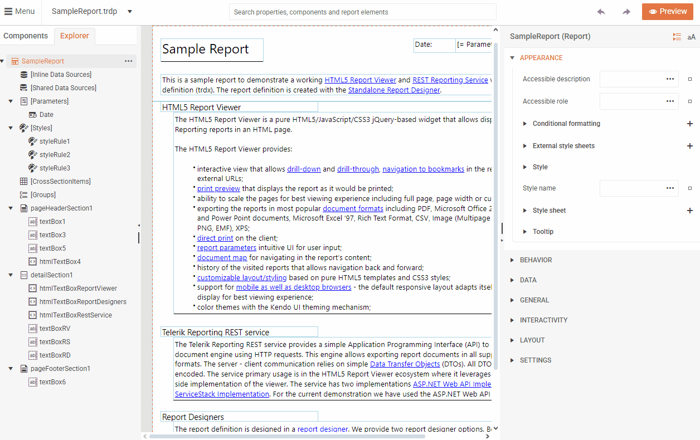
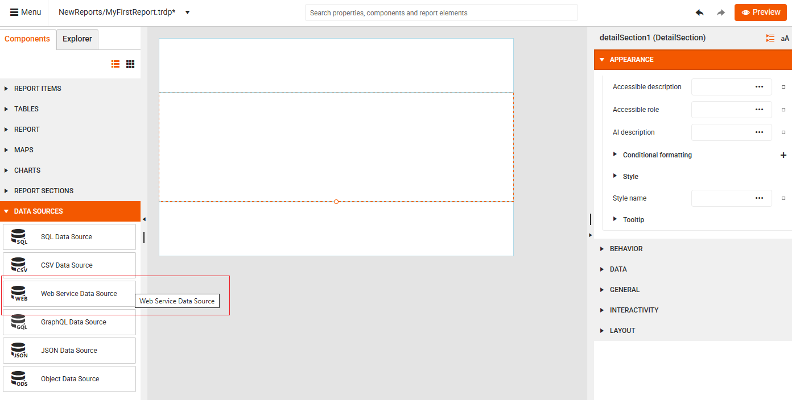
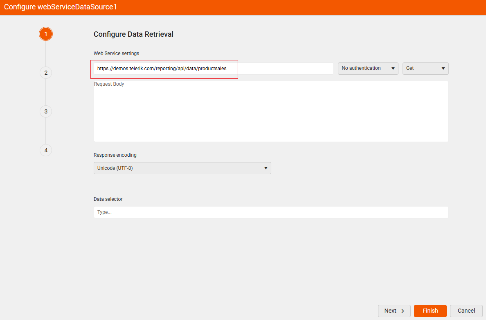
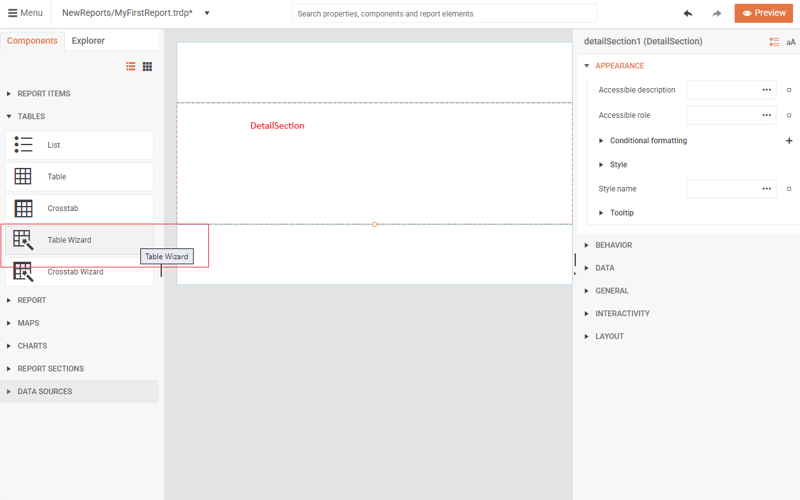
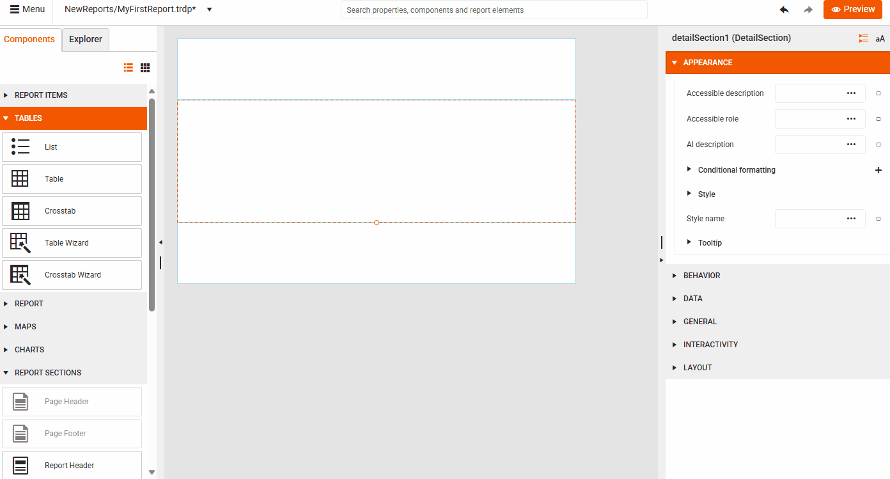
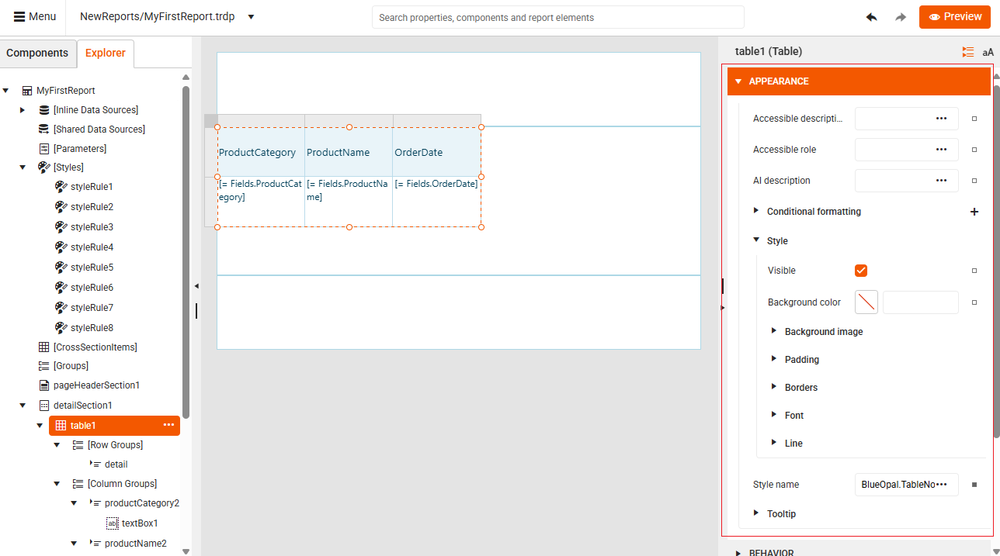
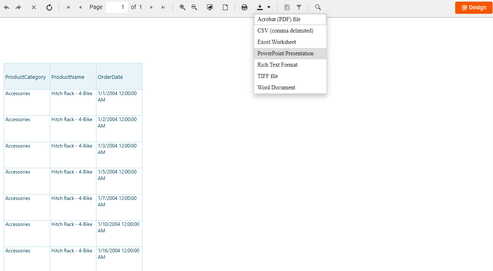

<style>
img[alt$="><"] {
  border: 1px solid lightgrey;
}
</style>

# Create Your First Report

Use this tutorial to create your first report in the Web Report Designer. You will create an empty report, connect it to a web service, add a table, and verify the result in the preview.

## What You Will Build

In this tutorial, you create a simple report that:

* Connects to a Telerik demo web service
* Displays data in a formatted table
* Can be previewed and exported

## Before You Start

Make sure you have access to:

* A running instance of the Telerik Web Report Designer where you can create a new report.
* A data source to feed the report with data. This tutorial uses a Telerik demo web service, but you can also work with SQL, CSV, GraphQL, and other [supported data sources](slug:web-report-designer-user-guide-components-data-sources).

>important
> This tutorial uses the Telerik demo web service endpoint. If your environment cannot reach external URLs, replace it with a web service endpoint that your Web Report Designer instance can access.

## Creating the Report and Connecting It to Data

1. Create a new empty report by clicking **New Report** in the main menu:

    

1. On the **Components** tab, go to [Data Sources](slug:web-report-designer-user-guide-components-data-sources) and select **Web Service Data Source**:

      

    Alternatively, you can type "Web Service Data Source" in the **Search box** to let the designer locate the tool for you.

1. On the **Configure Data Retrieval** screen, enter the URL of the web service providing the data for your report and then click **Finish**.

    ```text
    https://demos.telerik.com/reporting/api/data/productsales
    ```

    

Now you have a blank report that is connected to data. The design surface remains empty at this stage because you have not added any report items yet.

## Adding Items to Your Report

Next, design the report by adding a Table report item to display your data.

1. Click the report's **Detail** section to select it as the target container for the report item. If the report itself stays selected, **Table** and **Table Wizard** remain unavailable.

    >tip
    > If **Table Wizard** is unavailable, click inside the **Detail** section again and confirm that the section border is selected before continuing.

1. Select the **Components** tab, and then click the [**Table Wizard**](slug:web-report-designer-user-guide-components-tables#using-the-table-wizard) button:  

    

1. Configure the table as illustrated in the animation below. Select the fields you want to display and arrange them in the table columns:

      

1. Optional: Style the table from the **APPEARANCE** section in the Properties panel:

    

1. Click **Preview** in the upper-right corner to confirm that the report loads data from the web service and renders the table:

     

If the preview is empty, confirm that the report uses the correct web service URL and that the Web Report Designer instance can reach that endpoint.

You have successfully created your first report with the Web Report Designer.

## Next Steps

Now that you have created your first report, you can:

* Add more [report items such as charts, images, and text boxes](slug:user-guide/components/report-items)
* Explore [supported data source types in the Web Report Designer](slug:web-report-designer-user-guide-components-data-sources)
* Learn how [report sections organize your report content](slug:user-guide/components/report-sections)
* Refine the layout with the [Table Wizard in the Web Report Designer](slug:web-report-designer-user-guide-components-tables#using-the-table-wizard)

## Video Tutorial

For a visual walkthrough, watch this video tutorial that demonstrates creating a report with a chart. The video covers the Visual Studio setup initially, but the Web Report Designer portion starts at the 3:08 mark:

<iframe width="560" height="315" src="https://www.youtube.com/embed/L-utkcB8-5c?si=bmJU9ggpSOykHdLK&amp;start=286&rel=0" title="Getting Started with the Web Report Designer: Part 1" frameborder="0" allow="accelerometer; autoplay; clipboard-write; encrypted-media; gyroscope; picture-in-picture; web-share" referrerpolicy="strict-origin-when-cross-origin" allowfullscreen></iframe>

## See Also

* [Web Report Designer](slug:telerikreporting/designing-reports/report-designer-tools/web-report-designer/overview)
* [Web service data source component overview](slug:telerikreporting/designing-reports/connecting-to-data/data-source-components/webservicedatasource-component/overview)
* [Web service data source wizard overview](slug:telerikreporting/designing-reports/report-designer-tools/desktop-designers/tools/data-source-wizards/webservicedatasource-wizard)
