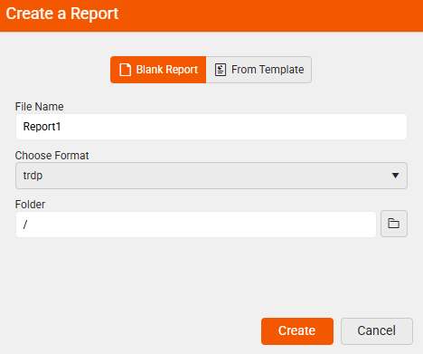
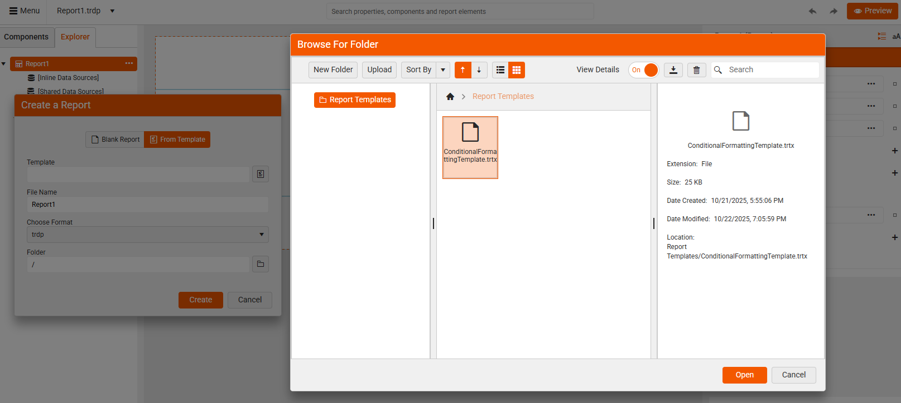

# Creating and Using Report Templates in Web Report Designer

|Minimum Version:|Q4 2025|
|----|----|

A **report template** is a reusable design that defines the layout, styling, and data structure of a report. It allows report designers to create consistent and professional-looking reports without starting from scratch each time.

## Key Benefits

Whether you are building dashboards, invoices, or summaries, report templates help you start with a solid foundation—saving time and ensuring visual and structural consistency across your reporting projects. Using templates offers:

* **Increased Productivity**—Templates offer a ready-made layout and structure, so you can focus on your data instead of design.

* **Ensure Consistency**—Maintain a uniform look and feel across multiple reports - especially useful for teams or organizations.

* **Simplify Design for Non-Designers**—Even if you're not familiar with styling or layout best practices, templates give you a polished starting point.

* **Customize and Reuse**—Easily adapt templates to fit different projects or departments, and reuse them to stay efficient.

* **Support Branding**—Include your company’s logo, colors, and fonts to ensure every report aligns with your brand identity.

## Working with Report Templates

When creating a new report by clicking the `New Report` option in the main menu, you are with presented two options:

  * Beginning from scratch with a **Blank Report**—Gives you an empty report.
  * Starting **From Template** (.trtx file)—Gives you a ready-made layout and structure to build on, making the report creation faster and more consistent.
    
|Create a Blank Report|Create From a Template|
|----|----|
| ||  

### Creating Report Templates

1. Create a blank report by selecting the **Blank Report** option.

1. Design the report in the Web Report Designer according to your needs.

1. Save the report as a template—This allows you or your team to reuse it for future reports. 

    When you wish to save the currently opened report, select the `Save As...` option from the Menu:

      

    The end-user is presented with the option to save the report either as a `Report` (.trdp or .trdx file format), or as a `Template` (.trtx file format).

    Select the **Template** option:

    |Save As Report|Save As Template|
    |----|----|
    | || 

### Using Report Templates

To start creating your report by using a predefined report template with a ready-to-use design, use the report template option.

1. Select the **New Report** option from the Menu:

	   

1. Create a report from an existing template by selecting the **From Template** option.

1. Navigate to the existing template (`.trtx`) file—When creating a new report, you can choose a template from the available list. The designer loads the layout and styles, and you can then customize the content and data bindings.
	
	 

1. Enter a file name and select the format for your new report:

	 

Now, you are ready to continue crafting your report loaded from a template.

>note Some users might not see the Report Templates options if they don't have such permissions (configured by the app developer).

## See Also

* [How to Edit a Report Template]()
