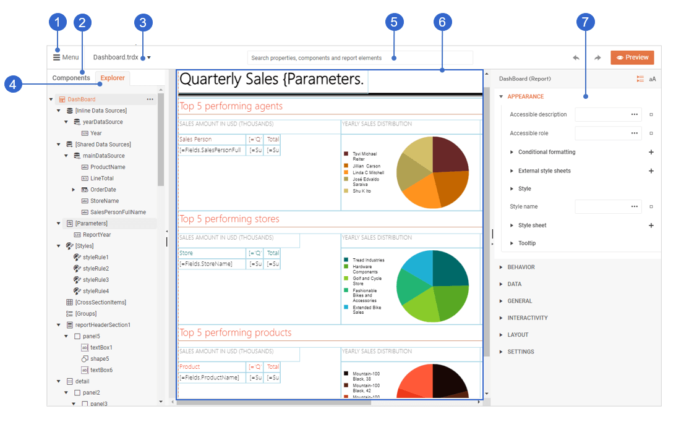

# Web Report Designer User Guide: An Overview

The [Web Report Designer](https://demos.telerik.com/reporting/designer) User Guide is intended to assist the end users of business applications that integrate [Telerik Reporting](slug:telerikreporting/welcome-to-telerik-reporting!). This guide aims to provide the knowledge required for the successful crafting and maintenance of reports. The primary audience for this user guide is business application users.

> If you are a developer who integrates Telerik Reporting into web applications, see the [application developer section](slug:telerikreporting/designing-reports/report-designer-tools/web-report-designer/overview) of the Web Report Designer documentation or the [Getting Started tutorial](slug:telerikreporting/getting-started/web-designer/set-up-and-create-basic-report). 

## What is the Web Report Designer?

The Web Report Designer is a tool developed to let business application users design, create, and export reports directly from their web browser without needing any additional software. The reports can retrieve data from a variety of sources, including relational or multi-dimensional databases, ORM entities, or custom data-layer-based data sources.

## Understanding the Workspace

The screenshot below highlights the main areas of the Web Report Designer interface:

1. Main menu—allows you to open or close reports, create new ones, access designer assets, adjust workspace preferences, and more.
1. Components tab—provides access to all components that you can include in your report, for example, text boxes, tables, charts, sections, and others.
1. Currently opened report—lets you switch between the opened reports.
1. Explorer tab—represents the structure of the currently opened report.
1. Search box—allows for quickly accessing the report components and modifying their properties.
1. Design surface—represents the layout of the report where you can visually arrange the report components.
1. Properties area—provides access to the properties of the currently selected report component.

## What's in this User Guide?

This user guide contains articles that describe common scenarios related to designing and configuring reports. You will also find conceptual information and videos that illustrate basic reporting principles, for example, how to [structure a report](slug:user-guide/report-structure).

## Next Steps

Use this guide when you want to:

* [Take the app tour of the Web Report Designer](slug:user-guide/app-tour)
* [Create your first report in the Web Report Designer](slug:web-report-designer-user-guide-getting-started)
* [Explore report structure in the Web Report Designer](slug:user-guide/report-structure)

## See Also

* [Build SQL queries in the Query Builder](slug:user-guide/query-builder)
* [Customize report behavior with the Expression Editor](slug:expression-editor-web-report-designer-user-guide)
* [Share resources with Assets Manager](slug:web-report-designer-user-guide-assets-manager)
* [Configure workspace preferences in the Web Report Designer](slug:web-report-designer-user-guide-workspace-preferences)
* [Use the AI Report Generator in the Web Report Designer](slug:wrd-genai-graph-gauge-design)




