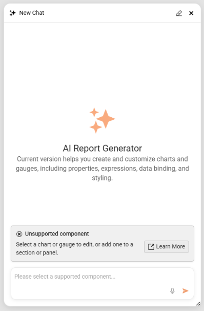
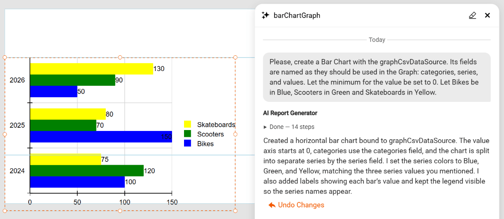
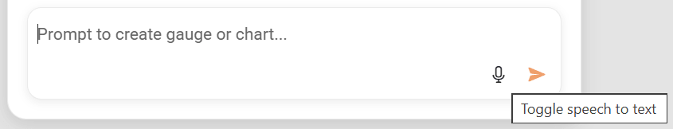

# AI Report Generator in Web Report Designer

The Web Report Designer includes an **AI Report Generator** experience that lets you create and edit [Graph](slug:telerikreporting/designing-reports/report-structure/graph/overview) and [Gauge](slug:telerikreporting/designing-reports/report-structure/gauge/overview) items from natural-language prompts. AI Report Generator combines an agentic workflow, on-the-fly JSON Schemas, and validation against the Telerik Reporting item model so the generated item is data-bound, valid, and ready to apply to the report.

> note AI Report Generator for `Graph` and `Gauge` items is available starting with the `2026 Q2 (20.1.26.615)` Telerik Reporting release.

## Overview

AI Report Generator targets the report items that are most time-consuming to wire up by hand. The current scope covers the following item types:

- **Graph** — bar, line, area, pie, and other supported chart variations.
- **Radial Gauge** — radial Key Performance Indicator (KPI) gauges with ranges, scales, and pointers.
- **Linear Gauge** — linear KPI gauges with ranges, scales, and pointers.

For every supported item, AI Report Generator follows the same pattern. It retrieves a JSON Schema for the requested item type, asks the language model to craft a complete item definition that conforms to that schema, validates the result against the report model, and iterates until the item is valid. After you accept the proposal, the Web Report Designer applies the item through the same design-time logic that backs manual edits, including support for undo and redo.

> important Currently, AI Report Generator generates only `Graph` and `Gauge` items. It does not generate full reports, data sources, parameters, or other report items.

## Opening AI Report Generator

To start an AI Report Generator session, follow these steps:

1. Open the report in the **Web Report Designer**.
1. Click the **AI Report Generator** button at the bottom-right corner of the report area.
1. The **AI Report Generator** window pops up, replacing the button.

## Prompting Tips and Examples

Concrete prompts produce better results than open-ended requests. Include the item type, the metric or category, the data fields, and any layout preference.

The following table lists prompt patterns for common scenarios:

| Scenario | Example Prompt |
|----------|----------------|
| Time-series line chart | `Create a line chart of monthly Sales from the Orders table for 2024, with months on the x-axis.` |
| Stacked bar chart | `Create a stacked bar chart of Revenue by Region, stacked by Product Category.` |
| KPI radial gauge | `Create a radial gauge that shows the current Customer Satisfaction score on a scale from 0 to 100, with a green range above 80.` |
| Linear gauge with thresholds | `Create a linear gauge for Server CPU usage from 0 to 100, with green up to 60, yellow up to 85, and red above 85.` |

To refine a result, describe the change in a follow-up prompt. For example, after the agent generates a bar chart, send `Sort the categories descending by value.`
## Data Source Usage

> AI Report Generator does not pass business data to the LLM. It works only with schemas.

**AI Report Generator** detects the available data sources from the current report definition and their field schemas, including calculated fields. The agent maps your natural-language intent to existing fields only and does not invent tables or columns. When required data is missing, the agent reports the gap and proposes alternatives.

## Create, Edit, and Question Flows

AI Report Generator chooses between a **Create flow**, an **Edit flow**, and a **Question flow** based on the message you send and the current selection on the design surface when you open the chat window.

The AI Report Generator uses the data schema of all defined data sources. It constructs a new item definition from scratch based on the recieved data context. It does not have access to the actual data rows.

### Create Flow

The **Create flow** runs when no supported `Graph` or `Gauge` item is selected. You must select the Report, or a Report Section/Item that can host the `Graph` or `Gauge`, for example, the Report Detail section, a Panel, etc.

If you select an item or section that cannot host the `Graph` or `Gauge`, the AI Report Generator will open in disabled state:

When you select a proper Report Section/Item, the AI Report Generator switches to its **Create flow**.

To create a new item:

1. Open the [AI Report Generator](#opening-ai-report-generator).
1. Type a prompt that describes the visualization you need, including the data fields, metric, and intended layout.
1. The AI Generator will generate the Graph/Gauge and show it on the design surface, or ask for clarification.
1. Review the item rendered with actual data. If the result is not as expected, select **Undo Changes** to revert it and refine your requirements.

When the item is created, the AI Report Generator transitions to Edit mode.

### Edit Flow

The **Edit flow** runs when a supported `Graph` or `Gauge` item is selected. The agent applies the changes to the currently selected item based on your prompt. Strive for descriptive prompts to create report items reflecting better your requirements.

To edit an existing item:

1. Select the `Graph` or `Gauge` item on the design surface.
1. Open the [AI Report Generator](#opening-ai-report-generator).
1. Type a prompt that describes the change, for example: `Switch the series to a stacked bar and add a legend on the right.`
1. The edited item is displayed on the design surface.
1. Review the item and if the result is not as expected, select **Undo Changes** to revert it and refine your requirements.

### Question Flow

In addition to authoring, the agent answers questions about `Graph` and `Gauge` items. Use this flow for prompts such as `What is the difference between a Bar series and a StackedBar series?` or `Which scale type should I use for time-based data on the x-axis?`. The agent answers in plain text without modifying the report.

When a request is unrelated to Telerik Reporting or falls outside the `Graph` and `Gauge` scope (for example, "add a TextBox" or "create a Table"), the agent declines politely and points you to the standard Web Report Designer tools instead.

## Speech-to-Text Support

> note Speech-to-Text support in AI Report Generator is available starting with the `2026 Q2 (20.1.26.615)` Telerik Reporting release.

The AI Report Generator includes voice input for the AI Assist prompt. A **Microphone** icon appears next to the prompt text box. You can click the icon to start or stop listening. The transcribed text appears in the prompt text box, where you can edit it before submitting.

To dictate a prompt with voice input:

1. Click the **Microphone** icon next to the AI Assist prompt text box. The icon and a short status label reflect the current state: **Idle**, **Listening**, or **Error**.

	The browser may ask you for permission to use the microphone. You must allow, if you want to use Speech-to-Text.
	
1. Speak your prompt clearly.
1. Click the **Microphone** icon again to stop listening.
1. Review and edit the transcribed text in the prompt text box.
1. Submit the prompt as usual.

Speech recognition relies on browser-native capabilities such as the Web Speech API. No external speech provider configuration is required. When the browser or operating system does not support speech recognition, the **Microphone** icon is hidden or disabled and shows an explanatory tooltip. The rest of the AI Report Generator continues to work normally.

If microphone permission is denied or revoked, a short non-blocking message appears and the control returns to the **Idle** state. If no speech is detected, a lightweight notification appears and you can retry immediately.

The **Microphone** control is keyboard-accessible and exposes ARIA labels and status announcements for screen readers, consistent with the existing Web Report Designer accessibility support.

## Security, Privacy, and Limits

**AI Report Generator** sends the user prompt, the relevant JSON Schema, and the necessary report metadata to the configured language model. Live data values are not sent unless the chat explicitly references them.

The feature follows the existing Web Report Designer security and telemetry patterns:

- Prompt handling, schema generation, validation tooling, and data access were threat-modeled to prevent prompt-driven data exfiltration or unintended actions.
- Basic usage telemetry is collected, subject to user consent and the existing Web Report Designer analytics configuration.
- Administrators control availability through host-level service registration and the `Commands_AIAgent_Use` permission, as described in [Configuring AI Report Generator in the Host Application](#configuring-ai-report-generator-in-the-host-application).

The current release has the following limits:

- AI Report Generator generates only `Graph`, `Radial Gauge`, and `Linear Gauge` items.
- AI Report Generator does not generate full reports, data sources, parameters, or other report items.
- The agent does not invent data fields. The bound data source must already expose the required tables and columns.
- A configurable retry limit caps how many times the agent revises an invalid item before surfacing an error.

## Next Steps

- [Designing Reports in the Web Report Designer](slug:telerikreporting/designing-reports/report-designer-tools/web-report-designer/overview)
- [Graph](slug:telerikreporting/designing-reports/report-structure/graph/overview)
- [Linear Gauge](slug:telerikreporting/designing-reports/report-structure/gauge/linear-gauge)
- [Radial Gauge](slug:telerikreporting/designing-reports/report-structure/gauge/radial-gauge)

## See Also

- [Configure AI Report Generator](slug:wrd-genai-implement)
- [Web Report Designer Overview](slug:telerikreporting/designing-reports/report-designer-tools/web-report-designer/overview)
- [AI Coding Assistant](slug:ai-coding-assistant)
