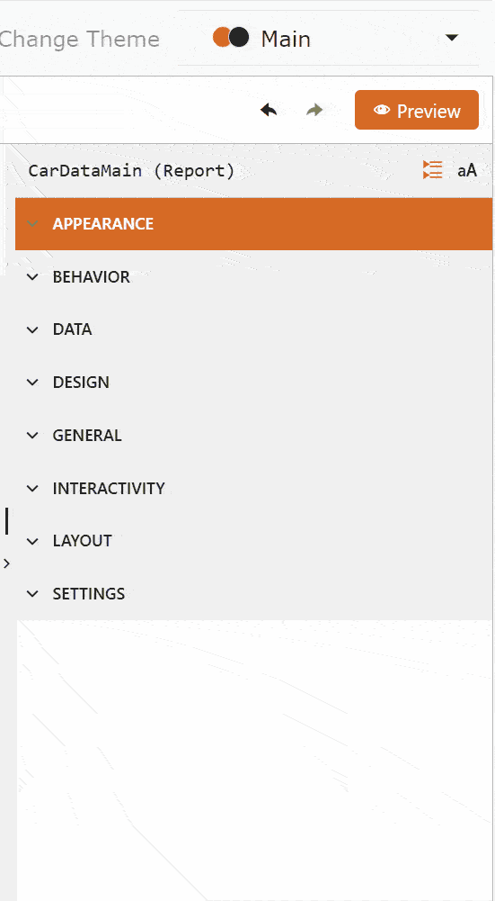
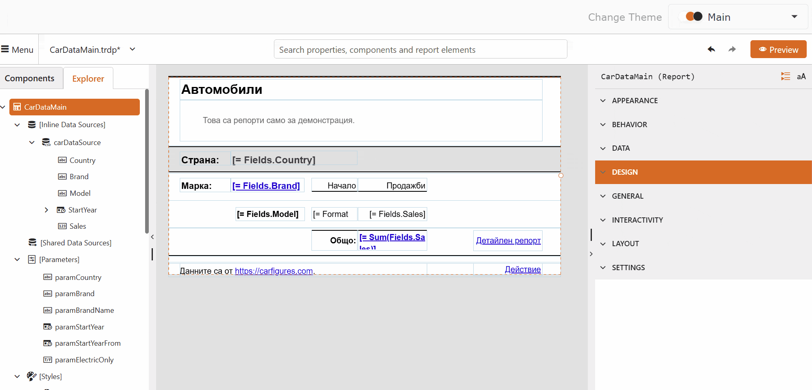

# Localize Reports in the Web Report Designer

Use report localization to create language-specific versions of the static content in a report. The Web Report Designer stores the language versions together with the report package and displays the version that matches the selected language.

> important Report localization in the Web Report Designer is supported only for TRDP report packages. TRDX and TRDJ reports cannot contain the localization resources.

## Before You Start

Make sure that you have access to the following:

* A running Web Report Designer where you can open and save reports.
* A report saved in the TRDP format.
* The cultures that you want to use in the report. The available cultures depend on the Web Report Designer configuration.

## Enabling Report Localization

Enable localization before you add language-specific content:

1. Open the report in the **Web Report Designer**.
1. Select the report. You can select the report on the design surface or in the **Report Explorer**.
1. In the **Properties** panel, expand the **DESIGN** group, and check the **Localizable** checkbox.

The **Language** property becomes editable after you enable localization.

## Selecting a Language

Select the language that you want to edit from the **Language** property:

1. Select the TRDP report.
1. In the **Properties** panel, open the **Language** drop-down list from the **DESIGN** group.
1. Select a culture, such as `en-US` or `bg-BG`.

The designer saves any unsaved changes before it changes the language. It then updates the report package and reloads the report with the selected language. Wait for the reload to finish before you continue editing.

To return to the base report language, select `(Default)` from the **Language** drop-down list. The base language contains the report values that the report uses when no language-specific value exists.

## Translating Report Content

After you select a language, edit the report content that you want to translate:

1. Select a report item that contains static content, such as a `TextBox`.
1. In the **Properties** panel, edit the value that you want to translate. For example, edit the `Value` property of a text box.
1. Repeat the process for each report item and localizable property.
1. Select **Save** in the main menu to save the language-specific values.

The designer applies the changes to the language that appears in the **Language** property. Changes that you make in one language do not overwrite the corresponding values in another language.

>important You cannot add new report items while the **Language** property contains a language other than `(Default)`. Return to `(Default)` before you add new report items, then select the target language again.

## Disabling Report Localization

Disable localization when you no longer need language-specific values:

1. Select the report.
1. In the **Properties** panel, expand the **DESIGN** group, and uncheck the **Localizable** checkbox.
1. In the confirmation window, select **Yes**.
1. Select **Save** in the main menu.

Disabling localization permanently removes all language-specific resource values from the report. The report keeps the values from the active language as its regular report values.

## Verifying the Localized Report

Verify the language-specific content in **Design** mode of the web report designer:

1. Select the language that you want to verify from the **Language** drop-down list.
1. Review the static content and switch between the available languages to compare the translations.
1. Select **(Default)** language if you need to add new report items.

> In **Preview** mode of the web report designer you will see the report with the culture corresponding to the current culture of the web designer application.

## Next Steps

After you localize the report, you can:

* [Explore the Report Structure](slug:user-guide/report-structure)

## See Also

For related information, see:

* [Create Your First Report in the Web Report Designer](slug:web-report-designer-user-guide-getting-started)
* [Configure the User Preferences](slug:web-report-designer-user-guide-workspace-preferences)
